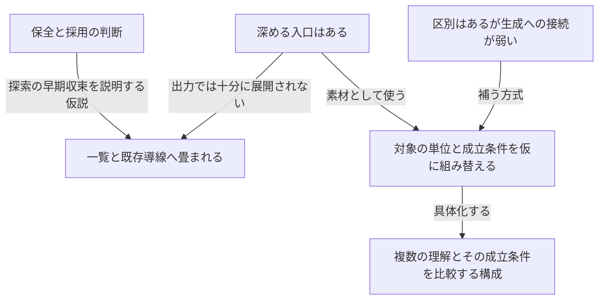
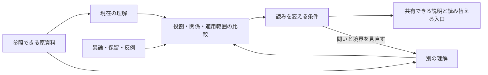

# 表層的な発想から、本質構造を変える発見へ

2026-10-08。依頼者が示したSUI Sensemakingの二資料を読み、CSWの本質価値に照らして問題と方式を整理した。文書から確認できること、担当AIによる解釈、今回導いた設計案を分ける。新しい実証実験は行っていない。

## 結論

文化体系を、機能を列挙するための問い集へ早く縮めてしまうと、正しい注意事項は増えても、対象の成り立ちを捉え直す発見は出にくい。CSWでは、体系の分節・関係・変化をまとまりとして仮に動かし、対象の何を一つと数え、何によってそれが成立し、どこを変えると意味が変わるかまで読む。その結果から、価値の成立条件と具体的な構成を導く。

今回、SUIについて中心に据える知見は次である。

**原資料へ戻れることに加え、同じ資料から別の理解が成立する条件を辿れることが、理解を育てる価値を支える。**

保存する資料、そこで読まれた意味、その意味を支える理由は、別々に変わり得る。この違いを扱うと、原文表示・異論の保存・履歴表示という機能一覧から、複数の理解を比較し、その成立条件を見直せる構成へ進める。

これはSUIの現行実装に新機能が欠けていると断定したものではない。すでにある概念や接続を、どの仕事のために働かせるかという設計案である。SUI側の意味モデル、権限、安全方針、公開範囲を変更する判断は含めない。

## 読んだ資料と、判断できる範囲

分析した資料は、SUIの`01_Plans/cognitive_cultural_validation_plan.md`と`02_Architecture/cognitive_cultural_ideation.html`である。読み取り時のSUIのHEADは`1b9a320a457903d2bea0e2ba51611da408eee0ba`。二資料のSHA-256は末尾に記す。価値の正本である`ADR-0089`と、`02_Architecture/schemas.md`の意味モデル・所属・根拠関係の説明も確認した。

HTML内のデータには150案がある。全案の名称を読み、華厳、サーンキヤ、ラサ論、Llullとそれらの交差案の本文、六つの重点方向、四つの深掘り例、試行の入口を詳しく読んだ。計画書は全文を読んだ。すべての文化体系の原典を精読した、あるいは150案を実務で試した、という分析ではない。

HTMLはCSWの`4157b01e`にある資料を参照している。今回のCSWの出発点は`develop/v0.5.0@8d3a663`であり、後の研究整理も含む。生成時の会話、読み込んだスキル、実行ログは提示されていない。したがって、特定のモデルや未読のスキルが原因だったとは断定できない。ここでは、成果物に表れている構造と、現行の方法がそれを許す余地を分析する。

## 資料から整理した論点

親和図法の考え方に沿い、先に改善項目を決めず、資料の訴えを短い意味単位にしてから束ねた。以下は原文の転載ではなく要約である。

| 材料 | 内容と参照先 |
|---|---|
| M1 | HTMLは、体系の規則を仮に走らせ、抵抗や残差から新しい問いを作ると宣言している。「文化体系との接触から、何を生むか」 |
| M2 | 初期の15体系には各6案が並ぶ。I001〜I090。案数を価値とはしない旨も明記されている |
| M3 | I038・I130は、全体を替えることで部分の役割や意味が変わることを扱う。これは本質構造へ進める入口になっている |
| M4 | I006・I054・I078・I090・I120などは、対応の固定、権威、件数、流暢な説明を点検する。生成する機能案と、発想の扱いを律する注意が同じ一覧に入る |
| M5 | 四つの深掘り例は、根拠の経路・適用、異論別応答、二択の変更、観察への引継ぎを具体化している。全て架空例と明記されている |
| M6 | 計画の先行範囲は、原文への往復、別構成の比較、理解の差の引継ぎである。既存フィールドと小さな実装を優先する |
| M7 | 計画では、通常の方法、同等の一般的な問い、体系固有の操作の順に確かめる。一般的な方法で足りれば体系を常設しない |
| M8 | SUIの一次価値は、早すぎる分類・要約・合意を避け、意味を保ち、共有可能な理解へ育てること。優先順位では「意味の保全」が前に出る。ADR-0089 §1・§6 |
| M9 | SUIの意味モデルは種別・レビュー・権限・状態・アクセスをすでに区別する。複数所属もある。これらを今回の新発見と称してはならない。schemas.md §1.0.1・§3.3.3 |
| M10 | CSWの現行設計は、問題群の本質構造を読み、発見を具体的な構成へ変えると定義する。一方、発見の本文は操作の一覧から問いや出口へ進み、まとまりとして生成する見方の展開が短い |

M1・M3・M5は「深める入口はある」、M2・M4・M6は「発想が一覧と既存導線へ畳まれる」、M7・M8は「保全と採用の判断が探索を先に狭め得る」、M9・M10は「必要な区別はすでにあるが、その区別で何を生み出すかが弱い」という束にまとまった。最後の二つには担当AIの解釈が含まれる。

図を文章へ戻すと、資料に深い操作が無いのではなく、その入口から一つの構造を十分に展開する前に、一覧と採用可能な小機能へ収束している、という読みになる。保全や採用の条件がこの収束に関与する可能性はあるが、生成過程を観測した因果説明ではない。深掘り例の存在と、既存意味モデルの区別は、この批判から落としてはならない残差である。

## 何が表層化を招いているか

### 操作の名前はあるが、対象に対する帰結が短い

I038の「別の全体で役割を変える」は、華厳の部分と全体の関係へ触れている。ところが、同じカードを別の島に置くことから、資料の同一性、読みの同一性、支持の成立まで何が連動して変わるかは展開されていない。

深めるには「どんな機能を足すか」の前に、同じ資料が別の問いの中で別の意味を担うなら、理解の更新を資料の更新として保存してよいのか、を問う。ここまで進むと、原文と読みの分離が、単なる監査の作法から、理解を生成するための構成原理になる。

### 正しい注意事項が、発見そのものの代わりになる

権威を根拠にしない、件数を価値にしない、異論を消さないという注意は必要である。ただし、それを守ったことだけでは、新しい理解は得られない。I120の「同じ前提から出た多数案を見抜く」という注意は、今回の一覧自体にも向けられる。

今回の深掘り例は、飛躍を見つける仕事には具体的である。一方、SUIの価値を成立させる仕組みを、現行構成と異なる仕方で組み立てる仕事は弱い。この違いを「安全に書けたから十分」と閉じない。

### 保全する価値と、生み出す価値の比重が偏る

ADR-0089の一次価値には、意味を残すことと、理解を育てることの両方がある。計画は前者を丁寧に具体化したが、後者は「変わった読みを人が書く」という接続で止まりやすい。

出典と異論を全て残しても、それらがなぜ一つの問題を成し、どの区別によって別の解が見えるかは自動では生まれない。保全を維持したうえで、何を見分け、どの説明を使えるようにするかを、正面から設計する必要がある。

### 実装を小さくする判断が、思考まで小さくする

既存フィールドを流用できるか、必須入力を増やさないかという計画の条件は、実装判断として妥当である。それを探索の初めから価値の上限にすると、現在あるカード・島・関係線の使い道しか出なくなる。

人間の判断権、原資料への復帰、共有範囲などは保持する。画面構成や実装上の都合は、仮の構成を考えた後で差分へ戻す。両者を区別しても、外部への送信や無断の状態変更を許すことにはならない。

### 代替可能性と、発見を促す働きを混同しやすい

同じ結論を通常の方法で再現できることは、その方法を実装に使う理由になる。一方、それだけでは、最初にその問いへ注意を向けた文化体系の働きは否定できない。探索で使う価値と、製品に常設する価値は別である。

この区別は、CSWの[華厳の発見価値比較](../../../research/framework-candidates/comparisons/huayan-discovery-value.md)でもすでに示されている。指定資料の比較条件が全て誤りなのではない。常設しない判断を、着想の価値も無いという判断へ広げないことが必要である。

## 知恵が生まれる方式

### 一つの見方から、関係のまとまりを動かす

体系の用語を一般的な質問へ翻訳する前に、その体系では部分が何によって成立し、関係が変わると何が変わるかを読む。今回の対象をその見方で仮に捉えると、従来の説明では同じだった何が分かれるか、別だった何が連動するかを導く。

これには、Gentnerの構造写像理論が、属性の類似に加えて関係のまとまりと高次の関係を扱うことが参考になる。単独の語を似た機能へ置き換えるだけでは、そのまとまりが失われる。ただし同理論の形式的な写像をCSWの必須手順にはしない。[原論文、1983年、pp.155–159](https://groups.psych.northwestern.edu/gentner/papers/Gentner83.2b.pdf)

Schönは生成的な比喩を、問題をどう設定するかに関わる見方の移動として論じている。Dorstも設計における枠組みの形成を中心的な仕事として扱う。これらを、既存の問いへ案を足すだけでなく、何を問題と見なすかを動かす設計の参考にした。Schönは公開された章の要旨、Dorstは著者所属大学の公開要旨を確認した範囲であり、全文に依拠した詳細な理論の再現ではない。[Schönの章の要旨](https://www.cambridge.org/core/books/abs/metaphor-and-thought/generative-metaphor-a-perspective-on-problemsetting-in-social-policy/E480B763CC44D69A927508BF90117239)、[Dorstの論文情報・要旨](https://opus.lib.uts.edu.au/handle/10453/18751)

### 独立に変わるものを分け、交差の帰結を読む

今回、華厳からは「どの全体で、何として成立するか」を、ニヤーヤからは「どの理由と適用条件で、どの主張を支えるか」を開く。前者は意味と役割、後者は論証の成立を問う。概念の重なりを小さくし、単なる同じ分類の反復を避ける。

二つの軸の直交性は、数学的直交性や統計的独立性との近似性を重視して、定性的に判断する。今回は、資料の文面を変えずに役割を変えられること、役割を保ったまま支持や反例が変わり得ることを、分ける理由にする。読みの変更によって支持する主張も変わる場合には、残る依存を明示する。体系名が違うだけで独立とはしない。

一方の成果を他方で点検するだけで終えず、交差によって「同じ資料・同じ文面でも、理解の意味と妥当性が別々に変わる」という構成上の帰結を読む。この交差は分析者による構成であり、両伝統に共通する歴史的な方法だとは称しない。

### 洞察を、価値の成立条件から方式へつなぐ

「役割を変えて見る」という問いを残すだけでなく、なぜそれが価値へ働くのかを言葉にする。意味を固定せず、原資料も失わずに、同じ資料から別の理解を比較できることが、早すぎる分類を避けながら理解を育てる条件になる。その条件から、仮の読みと原資料を別々に扱う方式が導ける。

ここでいう知恵は、正しい注意事項の数ではなく、条件が変わったときに何を保ち、どの関係を組み替えると価値が成立するかという判断の足場である。以下の導出は、その足場を具体化する。

## SUIの本質価値を高める五つの導出

### 1. 同じ資料から、役割の異なる読みを共存させる

**入口**：I038・I039・I130は、全体・役割・複数所属へ触れている。SUIにはすでに`Affiliation`と、資料と意味成果物の一対一対応を避ける意味モデルがある。

**体系との接触**：華厳の部分と全体の相互関係から見ると、部分の意味は「その資料自体の属性」だけでは決まらない。同じ資料が、ある問いでは解決すべき負担、別の問いでは維持すべき条件として働くことがある。

**導かれる知見**：原資料の同一性と、問いの中で担う役割の同一性を分ける。単に複数の島へ所属させることから、問いを変えたとき、資料の何が保たれ、どの役割が変わったかを比較する。

**具体的な構成**：同じ原資料を参照する二つの仮の理解を並べ、その資料についての役割、他の資料との関係、説明が成立する条件を読み比べる。原資料を複製して二つの支持にせず、一つの資料を異なる理解の中で使う。既存の複数所属だけでこの仕事が成立するかは、保存と意味の対応を別に確認する。

これは「読みの種類」という新しい固定分類を足す提案ではない。既存の意味モデルを使い、理解の中での役割が変わる場面を扱う提案である。

### 2. 異論を、説明の境界を作り直す入口にする

**入口**：深掘り例`depth-dissent`とI138は、異論に答えた範囲と、残る異論を保つ。

**体系との接触**：stasisの争点の違いを読む操作と、華厳の全体・部分を往復する操作を組み合わせる。「内容が間違っている」という異論と、「その問いの切り方では、この材料の役割が消える」という異論を、仮に分けて考える。

**導かれる知見**：異論に返答を付けるだけでは足りない場合がある。異論の対象が、結論、定義、対象範囲、構成の境界のどれかによって、組み替える場所が違う。保留は結論を待つ状態だけでなく、問題の分け方を見直す入口にもなる。

**具体的な構成**：ある異論を保ったまま、元の問題の枠と、その異論から境界を変えた枠を比較する。返答が付いたかに加え、どの資料の役割と関係が変わり、どの対立は依然として残るかを読む。境界を変えても同じ条件で残る対立を、条件の創作で消さない。

この提案は`CritiqueInput`の種別を増やすことから始めない。現行の異論と保留を、問いと構造の変更へどう結びつけるかを具体化する。

### 3. 理解の進歩を、配置の差より「区別の変化」から辿る

**入口**：I130と第3計画は、配置の変更と理解の変更を分けようとしている。ただし、理解の差を自由記述するだけでは、どんな差を読むのかが曖昧になりやすい。

**体系との接触**：華厳の役割の変化と、ニヤーヤの適用条件を別々に動かす。原資料が同じまま問題の境界が変わる場合と、境界を保ったまま根拠の射程が変わる場合を比較する。

**導かれる知見**：理解が進むとは、説明が短く整うことだけではない。以前は同じだったものを分けられる、別に見えたものの成立条件を共有できる、ある説明が使える範囲を限定できることも進歩になる。未解決点が増えても、何が分からないかの区別が増した可能性がある。

**具体的な構成**：旧案と新案について、以前は同じだった二つ、今は分ける理由、維持した関係、使える説明の範囲を対象語で残す。`understandingDelta`への記述や既存成果への参照を、その差に沿って作る。差をAIが自動で採点したり、カード数と完成率へ置き換えたりしない。

### 4. 反例から、説明の使える範囲を構成する

**入口**：根拠の深掘り例とI121・I125は、理由から適用への橋と反例を扱う。

**体系との接触**：ニヤーヤでは、理由と結論の関係を示す例と、今回への適用を分けて開く。これを今回の設計へ返すと、資料が正しくても、そこから得た説明を別の場面へ持ち運べるとは限らない。

**導かれる知見**：反例は説明に付く警告だけではなく、その説明が成立する範囲を作る材料になる。「どの条件なら使えるか」を伴う理解は、未確認な万能説明より、後の判断に使いやすい。

**具体的な構成**：支持と反例を残したまま、適用条件を変えた二つの説明を並べる。どの資料は共通して使え、どの関係だけが成立しなくなるかを見る。共有する説明には、範囲と、その範囲を再検討する入口を含める。`EvidenceLink`を条件や伝達の汎用リンクへ読み替えず、まず説明と参照の組で表す。

### 5. 共有・再開では、結論へ戻るだけでなく、読みを組み替える足場を渡す

**入口**：第3計画は、前回の理由と次の観察を引き継ぐ。これは良い入口だが、「以前の理解を再現する」だけでは、新しい条件への読み替えが残る。

**体系との接触**：波航海術の資料が分ける事前の模型と現場の手掛かりを、理解の共有へ読み替える。模型を持つことと、新しい場所で同じ判断をしてよいことは別である。この読み替えは分析者による構成であり、航海技能の再現ではない。

**導かれる知見**：引継ぎには、結論を思い出す索引に加え、その理解をどこから読み替えるかという足場が要る。後の利用者や後日の自分が、異なる条件で以前の結論を固定しないためである。

**具体的な構成**：現在の説明、最も依存している条件、その条件が変わったときに戻る原資料や別構成を、必要な範囲で渡す。これは生成AIの内部思考ログを保存する提案ではない。人が読める判断理由と、読み替える入口を渡す。長期の差分再開と履歴管理は既存のW型反復へ接続し、CSWに別の管理機構を作らない。

## 一つの架空例で、構成まで展開する

以下は今回作った説明用の例であり、指定資料や実利用の観測ではない。原資料には「誰にも相談せず、その場で処理した」という一つの発話があるとする。

「迅速な処理」を全体の問いにすると、その発話は裁量が機能した例として読める。「責任の共有」を全体の問いにすると、同じ発話が、他者から見えない判断経路の例になる。華厳の部分と全体の関係を借りることで、資料の属性を「自律性が高い」に固定する手前で、どの全体の中でどんな役割を担うかが分かれる。どちらも、この発話だけで正しいと確認した説明ではない。

次にニヤーヤの理由・例・適用を開く。相談しなかったという行為は、裁量が適切に働いた理由になるのか。それとも、相談できなかっただけなのか。「その場で処理した」ことを、処理の質が十分だった証拠にはできない。今回どんな条件ならその理由が主張を支えるかを考えると、問いは「裁量を増やすか、相談を増やすか」から、「判断の自律性と、判断の影響を他者が把握できることを、どの条件で両立させるか」へ変わる。

ここから、原資料に戻るボタンや反例欄を追加することに加え、二つの理解を同じ資料から組み立て、役割と適用条件の違いを比較する方式が導ける。例えば、裁量が働いたという読みを保ったまま、後で共有すべき影響があるかという条件を別に置く。相談の有無だけで二つの価値を一緒に採点せず、どの資料がどちらの説明に必要かを確かめる。条件を置いたことと、実際にその条件が満たされたことは分ける。

SUIでは、利用者が同じ発話を二つの仮の理解へ参照し、問い、担う役割、支持できる主張、まだ分からない条件を並べて読める構成にする。新しい資料が来たときは、発話の文面を更新するのではなく、影響を受けた役割や適用条件へ戻れるようにする。この仕事を、既存の意味成果物と参照でどこまで表せるかを設計する。

共有される理解は、全員が同じ評価を採ることだけでは成立しない。同じ資料から評価が分かれる理由と、読みを変える条件を互いに辿れることも、共有可能な理解の一つの形になる。これが今回の構成で育てたい価値である。この架空例から一般的な効果や実装上の欠陥を認定しない。

## 採用したい構成

五つの導出を別々の文化体系ボタンにせず、同じ資料から複数の理解を作り、その違いを成立条件へ戻す一つの仕事として組み合わせる。

同じ資料を残すことで、別の理解の違いを原文の書き換えに紛れさせない。異論と反例は、単に付録へ保存するのではなく、比較する理解の境界と適用範囲へ働かせる。共有するのは万能な一つの結論ではなく、どの条件で使え、何が変われば戻るかが読める説明である。

SUIの意味モデルには、資料、仮説、構造、統合、レビュー、判断を分ける設計がすでにある。この構成は新しい階層モデルを足す提案ではなく、その区別で「理解を育てる」を具体化する案である。新しい永続フィールドや現行APIの変更は、別の設計判断になる。

## CSWに反映する方式と、外へ置く内容

CSWの`core/discovery-pathway.md`には、本質構造の深化が求められたときに、体系の関係をまとまりとして仮に動かし、対象の単位・成立条件・変化の帰結を展開する案内を加える。機能一覧へ早く畳まないこと、生成と常設の判断を分けること、価値の成立条件から方式へ進むことを、既存の経路へ接続する。

今回の依頼と、本質価値の既存定義に沿った設計上の明確化である。一つの実験結果を一般化した規則でも、深い発見が必ず出ると保証する規則でもない。全依頼へ同じ項目数・体系数・段階数を課さず、深い発見が求められた場合の案内にする。

SUIの五つの導出、画面・保存・共有の構成、価値の解釈はこの文書へ置く。CSWの方法本文へSUI固有の品質基準を入れない。親和図法は材料の束と関係を作る別スキル、反復探索は後の材料で再開する別スキルとして保つ。研究の既存判定や体系の採用状態を、今回の机上の分析だけで書き換えない。

## 呼び出す際に渡せる指示

次は、本質価値を深めたいときに使える指示例である。常時の必須入力欄にはしない。

> 文化体系を使い、対象の本質価値を成立させる関係と条件を捉え直してください。既存の機能名へ早く対応づけず、対象の何を一つと数え、何が変わるとその意味・役割・成立条件が変わるかを、体系の分節と関係から仮に展開してください。有望な見方を掘り下げ、必要なら概念的な関与の低い別体系と交差させてください。その結果から、従来の理解との差、価値が成立する理由、具体的な構成を導いてください。見方に収まらない対象の具体性も残し、資料が支えること、生成した仮定、設計として選ぶことを区別してください。既存資料と定性的判断で選べる案は、実証実験の計画へ戻すだけで終えないでください。

## 資料へ戻した確認

保持したのは、指定資料にある原文・異論・保留への往復、複数の読み、意味の差、生成と帰属の区別である。今回新しく導いたのは、それらを「資料・役割・支持が別々に変わること」と「理解の成立条件」へ接続する構成である。元資料がこの全体構成をすでに提案していたとは書かない。

残るのは、体系との接触が実際の利用でどれほど発見を促すか、SUIの既存経路だけでどこまで成立するか、どの表示が利用者の負担を増やすかである。これらは未確認だが、今回の方式を設計するために新しい実験の完了を待つ必要はない。

対象資料のSHA-256を以下に記す。

- `01_Plans/cognitive_cultural_validation_plan.md`: `9116ec23c8e473bad86a6f7595b3bfd08fc022a070f4e5577ad459f99a8bdc13`
- `02_Architecture/cognitive_cultural_ideation.html`: `aede09794764339e6ed5c7eabc4386ddf2f32cebe586e6b0c140b086121ee87d`
