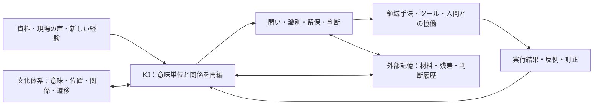

# 文化体系とKJ法による認知機能の定性的解析と再現設計

- 作成日: 2026-09-05
- 対象: v0.4.0の日本語正本と、著者が示した長期的な思索・執筆、および企業活動における人間とAIの協働という利用目的
- 状態: 機能仮説と研究設計。新しい実行規則の確定版ではない。
- 関連: [全体理解と改善方針](skill-improvement-direction.md)、[長期継続チャット観察](kj-atlas-case001-longitudinal-companion.md)

> 本書は `main@43a0933` の読解と著者との対話から作った設計仮説である。2026-09-05に既存の `develop/v0.5.0@72b6f18` へ移した。現行版への実装では、特に利用量・採否・停止を著者や委任先へ留保する境界と、既に追加された認知姿勢・体系想起・KJ手順を再確認する。本書の仮説や旧版の説明を、現行スキルより優先する実行指示にはしない。

## 1. 獲得したい能力

本スキルが目指すのは、一つの対象を長く考え続ける過程で、文化的体系が内包する文化的・数理的構造に触れながら、対象への注意、問い、関係の捉え方、変化の試し方を更新できることである。KJ法は、その更新に耐えられるように、異質な材料の意味と由来を保持し、材料のまとまりを作り直す。

その先の構想として、留保・識別・広域視野を備えたAIが、組織の継続的な思索と実行をつなぐ中心を担うことを目指す。経営、業務システム統廃合、その他の企業活動における高度な思索・ツール活用・コミュニケーションを、人間との協働の中で持続できる能力へ発展させる。執筆実践は、この能力を抽出する最初の具体的な入口として位置づける。

著者は、直近のChatGPTチャットでKJ法と文化的体系を用いた執筆に効果を得たと報告している。この報告を、再現したい実践が存在するという出発点に置く。現時点では該当チャットを特定できておらず、具体的な体系、介入、原稿の変化は未確認である。本書に記す機序を、そのチャットで実際に起きたこととして扱わない。

再現の対象は、注意の向け方が変わり、従来は見えなかった関係が生まれ、その関係を使って材料や構成を扱いやすくなるという働きである。同じ文言や結論への収束は要求しない。反例によって異なる結論へ進めることも、その働きが保たれた結果になりうる。

## 2. 定性的解析から得る中心仮説

現行正本には、文化体系を認知資源として使うこと、KJと往復すること、残差を後から再開することが既に書かれている。本書では、それらが一体として何を可能にするかを、次の仮説として捉える。

> 文化体系は、対象について次に気づけるものの範囲と、試せる関係・変化の候補を動かす。KJ法は、その動きによって元材料の意味が失われないようにし、新しいまとまりを立ち上げる。両者の履歴が保持されると、後の経験や資料を以前とは異なる問いで受け取り、対象理解を更新できる。

この仮説では、文化体系の価値は、最終原稿に残る象徴や用語だけには現れない。後に何を読むか、どこを観察するか、何を比較し、どの構成を試すかが変わることにも現れる。そこで生まれた問いが後日の資料に触れて働く場合は、直後の回答だけでは効果を捉えきれない。

KJ法も、着想の誤りを検査する役割だけにはとどまらない。何を一つの意味単位として扱うか、どの断片がともに訴えているかを作り直すことで、文化体系に接触させる対象の捉え方そのものを変える。文化体系が問いを動かし、KJが対象のまとまりを動かす。その往復から、どちらの初期配置にもなかった構造が生まれる可能性を調べる。

研究者の日常に相当する部分は、利用者が持ち帰る経験・読書・違和感と、再開時に参照できる外部記録によって支える。対話が止まっている間もモデルが考え続けることは前提にせず、再開後にどの材料を以前とは違う問いで受け取れたかを見る。時間が経ったこと自体を効果とは数えない。

## 3. 「文化体系を通過させる」とは何か

対象を体系の項目へ割り当てる以外にも、体系への接触には複数の働きが考えられる。

### 文化的な意味と数理的な構造をともに保持する

文化体系の資料には、原典・系譜・使用場面・象徴・価値の緊張がある。そのうち数理的に扱える部分があれば、位置、順序、隣接、対称性、遷移、周期、組合せ、禁止された操作などを区別できる。ただし、すべての体系がこれらを備えるとは仮定しない。

形式的な構造だけでは、どの差異が文化的に意味を持つのかが失われる。象徴語の連想だけでは、なぜある関係や変化を試すのかが曖昧になる。再現設計では、採用した文化的意味と、その場で利用した構造・操作を結び付けて保持する。

数や図式が現れただけで、その操作を伝統に由来するものとは扱わない。原資料に記載された操作、採用系譜での慣習、分析者が構成した操作を区別する。計算で確認できるのは宣言した形式の整合性であり、文化的解釈や対象への適合は別に確かめる。

### 構造の違いが、試せる問いを変える

以下は、現行本文の位置・関係・時間・遷移という資源を、認知機能の観点から読み直したものである。特定の文化体系の内容を記述した表でも、著者の実例を再現した結果でもない。実際に使う場合は、その体系の採用資料に該当する構造があることを確かめる。

| 構造 | 試せる操作 | 認知に期待する変化 | 構造だけでは言えないこと |
|---|---|---|---|
| 順序・隣接・経路 | 要素の有無に加え、接続と途中の位置をたどる | 「何が足りないか」から「何と何の間で途切れるか」へ問いが動く | 対象にその経路が必要であること |
| 周期・位相 | 同じ位置への再来と、その間に変わった条件を比べる | 単なる反復から、蓄積やずれを伴う再来へ注意が動く | 現実の対象が周期的であること |
| 対称性・反転 | 許される変換の前後で、残る関係と変わる関係を比べる | 見方に依存する差と、変えても残る差を問い分ける | 対象の二つの立場や状態が等価であること |
| 状態・遷移・禁則 | 許される移動、中間状態、到達しない位置を試す | 静的な特徴の説明から、変化の条件や別経路の構想へ進む | 形式上の到達可能性が現実の実行可能性を意味すること |
| 異なる分類原理の組合せ | 一つの見方で同じだったものを別の見方で分け、交点を見る | 既存の分類にはなかった関係候補を作る | 空の交点が対象の欠陥であること |

数学的に同じ形を持つ体系でも、文化的に何を重く見るか、どの象徴がどの経験を呼び起こすかは同じとは限らない。再現の際は、形式を残した比較と、文化的な意味も含めた接触を取り違えない。その違いが機能に必要だったかを確かめることも、定性的解析の課題になる。

### 対象との接触は部分的でよい

体系のある関係や変化に、対象の一部を接触させる。その結果として、別の位置から見る問い、未検討のつながり、中間状態、異なる順序、保持すべき差異が候補になる。対応しない材料は残す。全材料を一つの体系へ収める必要はない。

ここでの「通過」は、対象を符号化して逆変換すれば元に戻るような操作ではない。着想や構成案には、対象の材料と体系由来の見方が混在しうる。だからこそ、元材料と接触前の理解を保持し、何が新たに持ち込まれたかを確かめる。

生成・構成では、体系が与えた対照や順序を構成資源として試せる。現実の対象に同じ因果や遷移があると主張する場合は、対象側で独立に確かめる。探索を始める条件と、対象について断定する条件を同じにしない。

### 体系に触れる前から、得られる問いを決めきらない

現行の「対象側の未処理構造から開く」という原則は維持する。その理由は、完成した問題文である必要はない。材料に戻れる違和感、現在の見方では扱いにくい対立、同じ説明へ戻ってしまうことも、探索理由の候補になる。

この点は、現行KJの「理由の言えない注意」と文化体系のprobeを接続する改善仮説である。体系へ触れる前に、得られる増分まで証明することを要求すると、未知の問いを生む余地がなくなる。一方、理由のない体系巡回を標準手順にもしない。接触後に、注意や問いが実際にどう動いたかを確かめる。

## 4. 獲得を目指す認知機能

次の区分は分析のための観点であり、毎回すべて実行する段階や、材料の分類箱ではない。

| 機能 | 文化体系との接触に期待する働き | KJが担う働き | 再現時に確かめる変化 |
|---|---|---|---|
| 注意の方向を変える | 視点、尺度、中心と周辺、境界、時間の捉え方を動かす | それまで前景に出なかった札を、意味を変えずに扱う | 新たに読む資料、観察箇所、比較対象が具体的に変わる |
| 異質なものを包括する | 同一の分類では扱えないものの関係や、異なる層の併存を考える | 対立、孤立、両義性を消さずにまとまりを作る | 説明から落ちていた材料が、差異を保ったまま全体へ関わる |
| 変化を試行する | 根拠のある状態・順序・遷移・組合せを操作し、中間点や別経路を考える | 操作結果を元材料へ戻し、仮説と観察を混ぜない | 従来なかった、対象で検討可能な変化や構成の候補が生まれる |
| 認知の向きを制御する | 視点を広げる、局所へ戻る、時間を進める、別の体系へ移る選択肢を与える | 変更前の材料面へ戻れる足場を残す | 誤った見方から離れ、必要な観察・比較・保留を選び直せる |
| 後から意味を受け取る | 一度生まれた問いや対照が、後日の資料に反応する手がかりになる | 孤立や残差を保存し、新資料とともに束を組み替える | 新資料が既存説明に追加されるだけでなく、以前の問いや構造を変える |
| 複数の見方から第三の構造を得る | 一つの体系では扱えない差が、異なる見方の接触から現れる | 元の二つの体系へ還元できないまとまりも材料に照らす | 新しい構成や問いの由来を追え、対象に対する使い道を説明できる |

包括化とは、異質な材料を、相違や未接続の箇所を残したまま同じ検討の場に置き、互いの関係を扱えることである。何が含まれ、何がまだ関わりを持てないかも読める状態を目指す。

制御能力には二つの水準がある。まず、注意や問いの向け方を選び直せるという認知上の制御がある。そこから対象への働きかけを選べるようになる可能性はあるが、実対象を制御できたかは、領域側の実行結果で別に確かめる。体系上の操作可能性から、現実世界の制御可能性を導かない。

## 5. 長期的な思索を支える状態

一回の対話の成果だけを保存すると、次の対話は完成した説明から始まりやすい。再現に必要なのは、説明ができる前に何が引っかかっていたか、どの見方が何を開き、どこで行き詰まったかにも戻れることである。

設計を点検するため、ラウンド時点の状態を便宜上、次のように表す。

```text
X_t = (M_t, Q_t, A_t, K_t, H_t, D_t)

M: 元材料と出所
Q: 現在の問い、保留された問い、言語化しきれない注意
A: 今どこを見ているか、背景へ下げたもの
K: カード、束、表札、関係、未接続、孤立の時点記録
H: 文化体系の資料・操作・不適合との接触履歴
D: 採用、修正、棄却、保留と、その理由・再開の手がかり
```

これは測定済みの認知モデルや必須スキーマではない。記録が何を欠くと次のラウンドで思索を継げないかを考えるための記法である。モデルの内的思考を推測して保存せず、利用者と確認できる問い、資料、操作、変更理由を扱う。各記号を新しい入力欄に変える必要はない。

次のラウンドでは、新材料と接点を持つ過去の状態を参照する。検索で似た札だけを拾うと、反対の材料や未接続の問いを落とす可能性がある。どの情報を再び前景へ戻すと、以前の結論を反復せずに捉え直せるかは、再現実験の対象にする。

過去へ戻れることと、元の見方が心理的に完全復元されることは異なる。接触前の記録は比較と修正の足場になるが、体系の影響を消去する証明にはならない。

## 6. 再現性として固定するもの

| 固定・保持するもの | 理由 | 対象に応じて変えてよいもの |
|---|---|---|
| 参照する文化資料の版・系譜と、実際に使った部分 | 同名の体系でも内容や解釈が変わりうるため | 読み込み深度、使わない部分、比較する体系 |
| 操作の意味、適用条件、何を確かめる操作なのか | 象徴語の挿入と構造操作を区別するため | 試行回数、順序、到達点 |
| 元材料へ戻る経路と、変換で守る意味 | 整った表現による上書きを検出するため | カードの粒度、束数、図や叙述の形 |
| 探索の由来、対象側の支持、採否の区別 | 支持が増えても発見由来を失わないため | 記録形式、必要な詳しさ |
| 再開に必要な残差と接触履歴 | 著者や長いチャットだけが知る前提を持ち運ぶため | 再開までの時間、新材料、担当者 |

再現性は三つの水準に分けて確かめる。第一は、同じ材料から同じ操作を実行できること。第二は、異なる実行者でも同種の認知機能が働くこと。第三は、異なる対象でも適用条件に応じて機能を使い分けられることである。第一の水準だけ通っても、後の二つを確認したことにはならない。

最終文の一致よりも、たとえば「見落としていた関係に気づき、対象の資料へ戻って構成を修正できた」という機能の再現を重視する。ただし、その機能が働いたと判断できる変更前後と根拠は必要である。

## 7. 著者の執筆チャットから抽出するもの

全文を一度に一般化する前に、認知や原稿が動いた箇所を一つ取り出し、前後関係を読む。必要な材料は、対象の文章・素材、当時の問い、体系の投入箇所、著者の介入、変更後の文章や材料配置、後日の再訪である。個人情報や未公開原稿は、私的記録として保持する。

特に次の帰属を調べる。

| 観察する局面 | 判別したいこと |
|---|---|
| 体系に触れる前の停滞や違和感 | 問いが閉じていたのか、材料が足りなかったのか、文章化だけが難しかったのか |
| 著者による問い直し | スキルが行った操作と、著者が補った判断・専門知識・着想の区別 |
| 文化的な意味や構造への接触 | 名称や雰囲気が加わったのか、注意・関係・変化の見方が動いたのか |
| KJでのカード化・再編 | 既存の文化分類に収めたのか、材料から新しい意味のまとまりが生じたのか |
| 執筆への反映 | 文章技術の効果と、扱える材料や構成候補が変わった効果の区別 |
| 時間を置いた再訪 | 何が記録や著者の記憶に保持され、新資料の受け取り方へ働いたのか |

著者の介入が決定的だった場合は、介入のすべてをスキルへ取り込まない。介入が文化体系の操作やKJの戻し検査に属するなら方法候補とし、執筆の専門判断なら呼ぶ側の責務として明記する。どちらか判断できない部分は残す。

チャットの精読から得られるのは、まず機能仮説と再現に必要そうな条件である。成功を生んだ結論を先に教えた再実行は、独立した再現確認にはならない。

## 8. 再現を確かめる進め方

### 元事例の働きを復元する

変更前の材料と当時利用できた文脈から、何が起きたかを短い経過として残す。成功した箇所に加えて、採用しなかった対応や著者が修正した箇所も保持する。後から想像した基準線を、当時の実出力として補わない。

この段階で、原稿がよくなったという評価だけでなく、どの認知機能がどの材料によって見えるかを確定する。著者の「包括化した」「扱えるようになった」という実感は重要な観測として残し、それに対応する材料配置や判断の変化も調べる。

### 文脈を引き継いで再開できるかを見る

長いチャットで暗黙に保持されていた前提を、参照可能な状態にする。別の新しい対話へ必要な材料と再開状態を渡し、次の資料を受け取って思索を継げるか確認する。

ここで失われるものがあれば、規則を増やす前に、どの資料・残差・文化的な意味・著者の判断が引き継がれていなかったかを調べる。再開状態が不足していることと、方法そのものが働かないことを分ける。

### 機能に必要な寄与を比較する

方法変更を判断する必要がある場合に、条件をそろえた限定的な比較を設計する。たとえば文化体系に固有の寄与を問うなら、同じ材料と領域支援のもとで、KJまでを用いた場合と、必要な文化資料・操作を加えた場合を比べる。読み込みと操作の違いを問うなら、その違いだけを対象にする。

一度の比較へ多数の条件を詰め込まず、現に判断したい仮説に合わせる。否定的な結果が出た場合は、過剰適用、資料の不足、著者の専門性への依存、観測方法の問題を区別して調べる。比較のために利用不要な体系操作を強制しない。

### 別の実課題と後日の再訪で確かめる

元事例の答えや著者の誘導を渡さず、別の実課題で同じ機能が働くかを見る。続くラウンドでは、支持材料だけでなく、自然に得られた反例や以前の理解を揺らす材料も扱う。必要に応じて別担当者が、変更前後と根拠を見て判断する。

継承できた機能、著者固有だった部分、働かなかった条件を言葉で残す。この差が分かったとき、初めてどこまでを再現可能な方法として固定するか判断できる。

## 9. 現行スキルへの反映候補

| 現行の足場 | 今回、明確にしたいこと | 反映判断に必要なもの |
|---|---|---|
| `core/activation.md` のprobe | 言語化しきれない注意から体系へ触れ、接触後に問いを具体化する条件 | 無目的な巡回との違いが分かる実例 |
| `methods/system-selection.md` のモデル用途 | 体系名を選ぶ前後で、注意・包括化・変化の試行のどの機能が必要になったか | 実際の選択理由と、それによって動いた材料 |
| `methods/framework-application.md` の探索利用 | 文化的意味と数理的操作の関係を保ちながら、対象事実と混同せずに候補を生む方法 | 使用資料と操作を第三者が追える経過 |
| `methods/integration.md` の意味単位と戻し検査 | 包括化が、差異を保持した関係形成として働く条件 | 束や表札の変更前後、落とした差異、再編の理由 |
| `core/iteration.md` の残差と再開 | 長期チャットの暗黙の文脈を、別の対話でも継げる状態にする条件 | 新しい対話への引継ぎと後日の再編の記録 |
| `governance/evaluation.md` の増分 | 直後の所見に加え、後に何へ気づき、何を扱えるようになったかを見る | 観察・検索・構成・判断の具体的な変化 |

この表は、新しいモジュールや六つの必須段階を追加する提案ではない。既存本文に含まれる機能を、実例に照らして十分に実行可能な形へ明確化するための対応表である。

文化体系ごとの資料は、原典・系譜・形式・意味・限界を持つ準静的な資料層へ置き、対象ごとの問いや採否は動的層へ置く。実作業に使うことになった体系の必要部分から整え、汎用演算子へ平板化した資料集を先に大量生産しない。

今回、方法本文へ未検証の操作は追加しない。著者の実践から機能を抽出し、引継ぎと別課題での再現を確かめ、二つの中核能力に属する最小限の条件だけを正本候補にする。

## 10. 留保・識別・広域視野からタスク遂行能力へ

組織で必要となる能力を、三つの働きの相互作用として捉える。以下は獲得したい機能の定義であり、現行スキルで既に達成されたという評価ではない。

| 働き | 保持・操作するもの | 判断と実行へのつながり |
|---|---|---|
| 留保 | 未確定の主張、異論、判断を変えうる条件、まだ意味の分からない材料 | 未知を既知へ均さず、追加調査・条件付き判断・再訪を選べる |
| 識別 | 同じに見えて異なるもの、事実と解釈、目的と手段、局所と全体、可逆と不可逆、資料の独立性 | 統合してよい範囲、分離して扱う範囲、修正すべき箇所を判断できる |
| 広域視野 | 主体間・部門間の関係、複数の時間尺度、依存、境界、別の場所へ移る影響 | 局所的な判断を、周囲の条件や後続の変化に照らして選び直せる |

留保が識別と結び付くと、何が分かれば判断を進められるかが具体化する。識別が広域視野と結び付くと、一見同じ機能を持つものの異なる役割や依存を見分けやすくなる。広域視野が留保と結び付くと、全体像を一度で確定せず、別の主体の経験や後日の結果で組み替えられる。

留保は、すべての作業を止めることを意味しない。未確定な部分がどの判断へ影響するかを分け、根拠と委任範囲が足りている部分は進める。追加トークンは、留保を繰り返し述べるためではなく、必要な識別や調査を進めるために使う。

広域視野も、考えられる論点を際限なく列挙することではない。現在の判断に関わる関係をたどり、未確認の境界を残しながら、実行可能な範囲へ戻れることを含む。広げる能力と、必要な場所へ焦点を戻す能力をともに設計する。

## 11. 積み上げ的な思考とトークンの使い方

十分なトークンを使い、一回の回答では扱いにくい材料、複数の仮説、文化資料の厚み、操作結果の比較、元材料への戻し検査を扱えるようにする。この構想では、最短の回答や最少トークンへの最適化を第一に置かない。

積み上げる単位は、次の判断に使える変化である。たとえば、問いが具体化した、異なる二つの関係を識別できた、ツールで得た資料が仮説を修正した、保留していた案の成立条件が分かった、という変化を前の状態へ接続する。以前の結論をそのまま前提にして説明を増やすこととは区別する。

| トークンを使う先 | 積み上げたいもの | 続けるかを判断する手がかり |
|---|---|---|
| 材料を厚く読む | 重要な文脈、例外、異質な訴え | 要約では失われていた差が、問いや判断に関わるか |
| 文化体系の意味と構造を読む | 既存の見方では試せない関係・変化 | その体系の具体的な内容が探索の方向を変えるか |
| 複数の解釈や構成を試す | 候補間の違いと、それを判別する条件 | 言い換えを超える違いがあり、対象で比較できるか |
| ツールで調べ、結果を照合する | 新しい資料、反例、操作の成否 | 独立した情報が得られ、以前の判断を更新できるか |
| KJで統合し、材料へ戻す | 差異を保ったまとまりと未接続の箇所 | 何が含まれ、何が落ち、どこを再編すべきかが分かるか |
| 人間と問いや判断をすり合わせる | 現場の条件、異論、意図、訂正 | 次の思索や実行に必要な前提が更新されるか |

長い文脈を保持することと、毎回すべてを読むことは分ける。元材料と判断履歴は外部に残し、その時点で必要な資料・対立・残差を作業中の文脈へ呼び戻す。要約には、元資料へ戻れる参照と、意図して省いた範囲を残す。保存方法や検索の実装は、スキルを動かす環境側で用意する。

トークン量を増やしたことだけで、独立した検討や深い理解が得られたとは扱わない。新しい材料、違う観点、異なる操作、比較可能な候補が必要である。現在の方法操作から新しい差が得られなくなったら、別の資料・ツール・人間の知見へ移るか、残差を保持して実作業へ戻る。著者や依頼者が示す資源制約の中で、認知上の働きに応じて配分する。

## 12. 組織の中心で人間と協働するための構成

ここでいう組織の中心とは、資料、問い、判断、実行結果が継続的につながり、人間が同じ対象を異なる立場から検討できる協働の中心である。AIが組織の全情報を一度に保持したり、すべての判断を一人で引き受けたりする構成を必須にはしない。

全体の能力は、次の役割を組み合わせて実現する。



| 役割 | 担うもの | 本スキルとの関係 |
|---|---|---|
| 基盤モデル | 言語理解、推論、生成など、利用可能な能力 | スキルは、その能力を課題と状態に応じて使う方向を与える |
| 文化体系とKJ法 | 見方の変更、異質な材料の統合、留保と帰属、再編と再開 | 本スキルの中核として扱う |
| 領域の知識と手法 | 経営判断、業務理解、システム設計などの専門基準 | 呼ぶ側の資料・専門スキル・人間の知見と組み合わせる |
| 継続状態とツール | 元資料、履歴、検索、計算、実行、結果の取得 | 外部の記憶・実行環境が提供し、その結果を対象材料へ戻す |
| 人間との協働 | 目的、現場の経験、異論、訂正、委任、採否 | 対話や実作業を通して状態を更新する |

本構想でいう認知能力の拡大は、モデルが使える見方・資料・操作・外部状態を組み合わせ、単発の応答では維持しにくいタスク遂行能力を、運用するシステム全体として持続させることである。基盤モデルの重みの変更は、このスキルの作用に含めない。

思索と実行の接点では、「何を確かめたいか」を資料取得・計算・実操作・人間への問いへ具体化し、その結果を次の思索へ戻す。ツールから返った内容がどの仮説や判断へ関わったかを保持する。ツールの操作方法や対外連絡の権限は、接続先と呼ぶ側の運用条件で定める。

コミュニケーションも、完成した結論を伝えるだけにはとどまらない。別の主体の経験を材料として受け取り、用語の違いを識別し、異論がある部分と合意できた部分を分け、次の判断へ返す過程として扱う。KJ法はここでも、異なる訴えを早く同じ意味へまとめないために働く。会議運営や文章表現の一般作法は領域側に置く。

業務システム統廃合であれば、見かけの機能が同じでも、誰のどの業務を支え、どの時期・例外・依存に関わるかを識別できることが、期待する能力の一例になる。本スキルはその問いや関係候補を立てる部分を担い、統廃合の是非や移行可能性は、実際の業務・データ・システム資料と専門的な検証へ戻す。これは用途の説明であり、実案件での効果を報告したものではない。

## 13. 開発上の到達目標

執筆実践から抽出する認知機能を、次の範囲へ段階的に接続する。これは実験ケースの割当や、領域別の達成件数ではない。

1. **思索を継げる。** 別の対話へ移っても、問い・対立・文化体系との接触履歴から対象理解を再開できる。
2. **判断のためにツールを使える。** 未確定な関係を具体的な調査や操作へ変え、その結果から判断を修正できる。
3. **人間の知見と協働できる。** 著者以外の人の訂正・異論・現場条件を取り込み、判断の根拠と役割分担を更新できる。
4. **企業活動の継続課題を扱える。** 局所の作業と広い関係、現在の実行と将来の変化を往復し、委ねられた仕事を進めながら未解決も保持できる。

確認するのは、読み取れた差異、判断の変化、実行結果、後日の再編である。トークン数、思考ラウンド数、ツール呼出回数、AIの自己評価は、能力獲得の代わりにはならない。スキル、文化資料、外部記憶、領域知識、人間の介入のどれが必要だったかを区別して、再利用可能な組合せを確定していく。

## 14. 到達点と次に必要な材料

今回定めた到達目標は、**留保・識別・広域視野を支えとして、対象を見る方向を変え、思索・ツール利用・人間との対話を積み上げ、組織の継続的な仕事を担えること**である。包括化と制御能力の向上を、この過程で確かめる。

機能仮説、保持する状態、再現性の区別、元チャットの精読観点、比較と正本への反映条件までを本書で具体化した。著者の執筆チャットのURL、または文化体系の投入前後と著者の介入が分かる抜粋があれば、その実例から最初の再現単位を確定できる。実例の精読、再実行、再現確認は未実施である。
