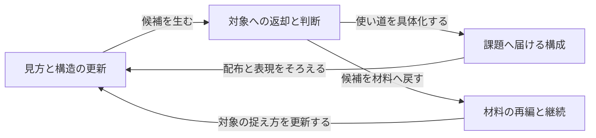

# 本質価値を読み解く材料統合記録

作成日: 2026-10-05。既存文書を読み、初期案を親和図法で再整理した今回の適用記録である。実験記録やモデルの内部思考の記録ではない。参照した実現は、研究段階の`research/skill-prototypes/affinity-synthesis/SKILL.md`とその方法定義である。入力の由来、統合した意味、設計判断、残った論点を後から確認できる形で記す。

## 入力の範囲

既存ファイルの読解時点は`develop/v0.5.0@c917f1e`。後続の変更案を、既存文書に最初から書かれていたことへ戻さない。依頼者の今回の指示は別の入力として扱う。各カードは以下の節を要約しており、直接引用ではない。

| カード | 材料が述べていること | 出所 |
|---|---|---|
| C01 | 研究者の異質な概念との出会いを、生成AIの発見経路として再構成したい | [根幹価値](core-value-and-embodiment-policy.md)「1. 根幹価値」 |
| C02 | 文化体系は問題群を包含する上位の視点となり、問題間の関係を見直す | 同「視点としての文化体系」 |
| C03 | 中心に期待するのは構造的な遠さそのものより、本質構造の特定である | 同「7. 仮説として保つこと」 |
| C04 | 体系の分節・遷移・実践知を取り出し、系譜を示す。すべての体系に同じ構造を仮定しない | 同「2. 文化体系から取り出すもの」 |
| C05 | 対象の具体性を消さず、文化体系も便利な汎用語へ弱めない | 読解時点の`src/ja-JP/core/principles-and-constraints.md`「二重の忠実性」 |
| C06 | 発見を促すことと、対象の所見を支えることは別である | [根幹価値](core-value-and-embodiment-policy.md)「触媒としての文化体系」 |
| C07 | 材料主導の意味単位・束・表札・関係・叙述を立て、元材料へ戻す。来歴は最初の束ねの分類軸にしない | `research/skill-prototypes/affinity-synthesis/SKILL.md`のCore Contract |
| C08 | 一致だけでなく、対象の抵抗と相互修正から生じた第三構造を扱う | 読解時点の`src/ja-JP/methods/transformation.md`「対象と体系の緊張」 |
| C09 | 採否、深度、停止、価値判断は依頼者または外部の委任が決める | 読解時点の`src/ja-JP/core/principles-and-constraints.md`「決定権」 |
| C10 | 後から来た経験や資料によって、以前の問いや材料のまとまりを更新できるようにしたい | [認知機能の構想](longitudinal-cognitive-functions.md)「2」「5」 |
| C11 | 領域の専門判断は呼び出し側に置き、得たものを成果物や実際の課題へ返す | [根幹価値](core-value-and-embodiment-policy.md)「6. 三つの方法への配置」 |
| C12 | 実行本文は責務を分けているが、配布説明にはCSWと統合手法を一体とする表現が残る | 読解時点の`src/manifest.json`、`adapters/claude-code/locales.json`と`ROUTER.md`の比較。今回確認した文書上の不整合 |
| C13 | 体系の古さや整合性、親和統合でのまとまりは、対象についての独立した支持ではない | [根幹価値](core-value-and-embodiment-policy.md)「5」、読解時点の`methods/integration.md` |
| C14 | 実験を前提にせず、定性的・人的な判断とリサーチで最適と思われる構成を作る | 今回の依頼者の指示 |
| C15 | 親和統合は本質価値を捉える思考に使い、スキルは分離する。公開の方式名を親和図法とし、日本語にはyomiyasuを併用する | 今回の依頼者の追加指示 |

C12は方法の理念を述べる材料とは別の証拠状態である。文書の比較結果として残し、利用者の誤解や被害を観測したカードには変えない。

## 材料から立てたまとまり

| 表札 | 含めたカード | 統合した意味 |
|---|---|---|
| G01: 見方を変え、対象の成り立ちと違いを捉え直す | C01、C02、C03、C04、C05 | 出会いと問題群の位置づけは、対象の構造を読み直す二つの働きとしてつながる。固有構造と具体性を保つことで、単なる言い換えを避ける |
| G02: 大胆な着想を、対象の根拠と判断に戻せる形で扱う | C06、C08、C09、C13 | 発想を開くことと、事実・採否を決めることを分ける。抵抗を残し、誰が何を根拠に判断したかを追えるようにする |
| G03: 材料のまとまりを更新し、後日の問いへ継げるようにする | C07、C10 | 親和統合は単なる整理でなく、対象の捉え方を作り直す。新たな見方を、材料と次の問いへ接続する |
| G04: 今回の課題へ使える構成を届ける | C11、C12、C14、C15 | 領域判断、実行入口、配布説明、日本語品質を、本質価値の具体化に向けてそろえる。実験待ちを設計の条件にしない |

C05はG02にも関わるが、複製して支持件数を増やさない。C15はG03にも関わる。主配置と意味上のつながりを区別する。

## まとまりの関係

図の関係は設計として読んだ関係であり、測定した因果ではない。各線を文章に戻すと、見方の更新は候補を生み、対象への返却でその使い道を具体化し、材料の再編は見直す対象そのものを更新する、という構成になる。

この叙述から、親和図法を必ずCSWの後段に置く構成は適さないと判断した。材料の理解が必要なら先にも使い、候補の再統合が必要なら後にも使う。スキルとしての分離と、思考における往復は両立する。

## 元材料への返却

| 統合後に点検したこと | 返却した結果 |
|---|---|
| G01が、遠い体系との接触だけへ縮んでいないか | C02・C03を保つため、問題群の構造読解を実行本文へ加える。遠さは手段として位置づける |
| G02が、発想を禁止する規則へ変わっていないか | C06・C09に戻り、仮説・構成資源・理由付き推奨を提案できることを明記する |
| G03が、親和統合と継続管理をCSWへ取り込んでいないか | 所有を分離したまま、前後の受け渡しで使う。兄弟スキル未導入の状態も示す |
| G04が、配布整合性だけを本質価値にしていないか | C11・C14へ戻り、入口から具体案までの方式を先に作る。ビルドはその配送を確認する操作とする |
| 人的判断をAIの独立査読へすり替えていないか | 依頼者の意向と既存の知見を入力とし、今回選ぶ構成は実行AIの設計判断として示す |

## 保持された意味、新たな設計、残った論点

保持した意味は、文化体系との接触、本質構造の特定、対象への返却、決定権、材料主導の統合、後日の更新である。

今回新たに構成したのは、構造読解と発見を並ぶ入口として置くこと、定性的な配置に理由と別の読みを添えること、具体案を選ぶところまで実行をつなぐことである。これは既存文書を統合して選んだ設計であり、元資料がすべてそのまま指示していたこととは区別する。

残る論点は、実際の利用でどの体系がどの対象に働くか、英語の独立査読、兄弟スキルを公開へ昇格する条件である。今回の構成を選ぶために、これらの実験や昇格を先に完了させる必要はない。

この記録は、[採用したプロダクト構成](value-first-product-design.md)と実行本文の変更を説明するために使う。材料を統合したこと自体を、有効性の証拠にはしない。
