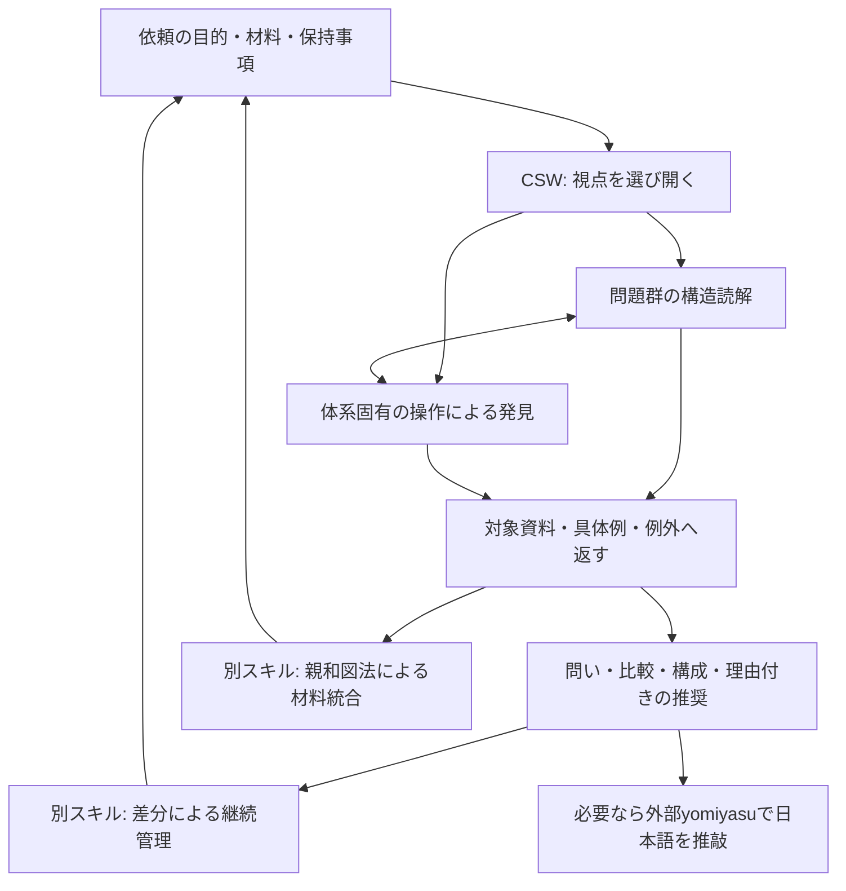

# 本質価値から組み直すプロダクト構成

策定日: 2026-10-05。対象は`develop/v0.5.0`の既存文書と実行本文。依頼者の指示により、実証実験を前提とせず、文書の読解、関連手法の調査、定性的な設計判断から構成を選んだ。これは設計判断の記録であり、有効性の測定報告ではない。

> 2026-10-08の深化方針と指定資料の分析は、[表層的な発想から、本質構造を変える発見へ](generative-depth-and-product-wisdom.md)にまとめた。価値を保全することに加え、価値が成立する条件から新しい構成を導く方式を補っている。

## 本質価値

**文化体系が内包する分節・関係・変化・実践の視点を借り、対象の本質構造を捉え直す。その見方から生じた発見を、対象に即した問い、比較、構成、判断へ具体化し、人間の思索を前へ進める。**

[根幹価値と具現化方針](core-value-and-embodiment-policy.md)は、研究者が日常の異質な概念との出会いから発見する体験を出発点にしている。10月4日の追記では、文化体系が問題群を包含する視点を与え、本質構造を特定する働きが中心に置かれた。[長期的な認知機能の構想](longitudinal-cognitive-functions.md)は、その見方が後日の材料や判断にも働くことを目指している。

この趣旨を受け、本質価値を三つの働きとして定義する。対象を何によって見るかを変えること、その視点で対象の構造を読み直すこと、得られたものを現実の課題へ使える形にすることである。長期的な継続は、これらを後日の材料へつなぐ支えになる。

文化体系の紹介、象徴の挿入、対応表の完成、資料や規則の増加は、それだけでは価値の実現にならない。対象について見える差や関係が変わり、依頼された思索・構成・判断に使えることを目指す。

## 不明瞭だった点を定義する

| 論点 | 今回の定義・選択 |
|---|---|
| 本質構造 | 今回の目的に照らして、対象の成り立ちや違いを説明する関係・条件・変化のまとまり。対象の唯一の本性とはしない |
| 上位の視点 | 同じ見方で問題群を見渡し、共通性と差を比較する範囲。文化体系の権威や真理性を意味しない |
| 評価する視点 | 何を区別し、比較し、問いとして重く見るかを与える。望ましさを判断する価値基準は、依頼者の目的や委任から受け取る |
| 発見 | 以前の見方では捉えにくかった区別、関係、条件、問い、構成が得られること。事実の確認とは区別する |
| 文化体系を使う理由 | 構造と文化的意味、実践が結びついた視点を借りられるため。古さや使用の蓄積を真理やAIへの効果の証明にはしない |
| 遠い体系 | 見方を揺らす選択肢。遠さを最大化することは目的にしない |
| 直交 | 視点間の概念的な重なりや相互依存をできるだけ小さくし、交差から独立性の高い要素を切り出すこと。数学的直交性や統計的独立性との近似性を重視する |
| 問題間の距離 | 採用した視点に沿った定性的な近さ・違い。数値や確率を前提にしない |
| 全体性 | 体系自身が持つ構造を局所の象徴へ縮めず読むこと。すべての体系や対象に閉集合・排他性・網羅性を仮定しない |
| 対象への返却 | 手元の資料、具体例、例外、専門知識、依頼者の経験や判断と照合すること。毎回の新規実験を意味しない |
| 親和図法との関係 | 本質価値を読み解く思考にも使う、材料から構造を立てる別の方法。CSWの視点による配置とは分離する |
| 人的な判断 | 人間の目的・経験・専門性にもとづく判断を受け取り、委ねられたAIの判断はその主体と理由を示す。AIの判断を独立した人手査読と呼ばない |
| 使える成果 | 対象語で読める比較、問い、説明、構成案、設計案、理由付きの推奨。仮説だからという理由だけで調査計画へ戻さない |

## 現行構成から何を変えるか

実行入口は、触媒的な出会いと構造的な遠さを強く前景化していた。一方、後から明確になった問題群の構造読解には、配置の理由、複数視点の交差、対象への返し方をまとめて実行する本文がなかった。

また、ソース本文では三つの方法の責務を分けているのに、配布説明と一部のアダプターにはCSWが親和統合も所有するように読める記述が残っていた。これは現行ファイルから確認した不整合であり、利用者が実際に誤解したという観測ではない。

そこで、価値から実行への主経路を作り直す。入口では依頼された成果と必要な働きを選び、詳細は必要に応じて参照する。既存ファイルの相対パスは接続と翻訳の互換性のため残すが、従来の経路や文量を設計の基準にはしない。

## 採用する構成

親和図法を必ず通る直列構成にはしない。材料から問題群を立て直すときは入口で使い、文化体系から得た候補を材料へ戻して組み直すときは途中で使う。少数の対象を直接比較すれば足りる場合は、CSWだけで進められる。

| 構成要素 | 所有する役割 | 実装・配置 |
|---|---|---|
| 実行入口 | 本質価値、依頼から働きを選ぶ、操作と成果をつなぐ | `src/<locale>/ROUTER.md` |
| 視点による構造読解 | 比較単位、定性的配置、理由、複数視点、対象への返却 | `methods/perspective-analysis.md` |
| 発見と具体化 | 体系固有の操作、接触、対象語への変換、用途別の成果 | `core/discovery-pathway.md` |
| 体系選定 | 認知上の仕事、構造核、資料・系譜、選定理由 | `methods/system-selection.md` |
| 帰属と変換 | 対象所見への条件、緊張、第三構造、用途の区別 | `methods/framework-application.md`、`methods/transformation.md` |
| 原則と接続 | 決定権、由来と支持、材料統合・継続管理への受け渡し | `core/`、`methods/integration.md` |
| 体系資料 | 採用した伝統の構造と操作、出典、限界 | `frameworks/`の索引と個別資料 |
| 親和図法 | 材料主導の意味単位、束、表札、関係、叙述、元材料への返却 | 別スキル。現在の研究実現は`research/skill-prototypes/affinity-synthesis/` |
| 継続管理 | 新材料の差分、触れた成果物の再開、履歴、停止・再開 | 別スキル。現在の研究実現は`research/skill-prototypes/iterative-inquiry-synthesis/` |
| 日本語品質 | 内容確定後の意味を保った推敲 | 外部の`yomiyasu`。未導入でもCSWは実行できる |
| 領域判断 | 専門知識、品質、望ましさ、実行責任 | 依頼者の文脈と領域スキル |

公開の方式名には「親和図法」を使う。手法の系譜は既存の研究資料に明示し、由来を消さない。この呼称の選択は今回の依頼に従うものであり、法律上の判断を確定した記録ではない。

## 具体的な方式

一つ目の方式は、問題群を体系の分節・関係・変化から読み、各対象の位置づけに理由と別の読みを添えることである。「近い」「遠い」は、どの関係や条件を共有するかで説明する。位置づけは、体系由来の見立てとして扱う。

二つ目は、直交性の高い視点で同じ問題群を別々に読み、交差から独立性の高い要素を切り出す方式である。概念の重なりや相互依存をできるだけ小さくし、一方の位置や状態が他方を決めてしまわない組み合わせを選ぶ。数学的直交性や統計的独立性との近似性を重視し、その理由を資料と人的な判断から示す。五行と五大は、異なる観念を交差させる基準例である。使う系譜と分節原理を明示し、共通する名称から一対一の対応を作らない。

同じだった対象が分かれる、違った対象が共通条件を持つ、境界の切り方が合わない、といった差を取り出す。交点をすべて埋めたり、同じ結果を独立した証拠に数えたりしない。

三つ目は、体系の位置、補位置、関係網、遷移、周期、境界、実践のうち、今回の対象に働く操作を仮に実行する方式である。対象の構造に一致することに加え、合わない具体性から新たな問いや区別を得る。

いずれも、候補を対象の言葉へ戻し、既存資料と例外に照らす。依頼が構成や選択を求めていれば、理由付きの具体案まで進める。候補の生成、支持の判断、採否を分けることによって、大胆な発想と対象への忠実性を両立させる。

## 選ばなかった構成と理由

| 構成 | 今回選ばない理由 |
|---|---|
| CSWへ親和図法と継続管理を戻した巨大なスキル | 異なる認知操作の責務が混ざり、必要な部分だけ使うことや置換が難しくなる |
| 三スキルを必須の直列工程にする | 構造読解だけで足りる依頼にも、材料統合と継続管理を課すことになる |
| 遠い体系を多数巡回する | 遠さと数が目的になり、今回の本質構造や成果への接続が薄くなる |
| 適合度を判定器で数値化して自動選定する | 今回は定性的な理由を説明すれば選べる。数値の定義と校正を先に作る必要がない |
| すべての位置・交点・操作を埋める | 網羅性を持たない体系や、部分的な対象にも形式を押し付ける |
| 実験の完了を構成案の条件にする | 今回求められている、既存資料と人的な判断による設計を進められなくなる |
| 日本語作法をCSW本体へ全面的に内蔵する | 外部の文章品質スキルが担当できる領域まで、本方法の規則として抱えることになる |

## リサーチをどう使ったか

Gentnerの構造写像理論は、類推における対象の表面的な属性と、関係構造の対応を区別する。今回、象徴語の類似だけで体系を選ばず、関係とそのまとまりを明示する設計の参考にした。この理論から、CSWの効果や文化体系の優位性を導いたわけではない。[原論文の要旨](https://onlinelibrary.wiley.com/doi/10.1207/s15516709cog0702_3)

川喜田研究所の解説は、定性的材料から仮説を発想し、ラベル、グループ編成、図解、叙述を一連の方法として扱っている。今回の文書読解では、親和統合を単なる仕分けに縮めず、材料から立つ意味と関係を元資料へ戻すために参照した。AIでの効果の証明としては扱っていない。[公式解説](https://kj-kawakita.co.jp/about_kj-method/)

外部の[Affinity Mapping](https://raw.githubusercontent.com/product-on-purpose/thinking-framework-skills/main/skills/think-affinity-mapping/SKILL.md)と[Concept Mapping](https://raw.githubusercontent.com/product-on-purpose/thinking-framework-skills/main/skills/think-concept-mapping/SKILL.md)も現行本文を確認した。前者の材料からテーマを立てる役割、後者の関係を文として読み返す役割は併用候補になる。CSWの文化体系による視点の形成や、既存の親和統合実現が保持する変換来歴を、単独で代替するとは判断しなかった。外部スキルの項目数・重み・リンク数などの既定条件は本体へ取り込まない。

これらの資料と既存文書から、今回は説明可能な定性的な配置、操作、返却を中心に選んだ。この選択は、実験で証明した最適解ではなく、今回の目的と責務境界に照らして最も妥当と判断した構成である。

## 配布への反映

OpenAI、Claude Code、Codexの入口は、同じ日本語正本と英語訳から生成する。名前、インストール経路、既存の呼び出し方は保ち、説明を構造読解・発見・具体化へそろえる。兄弟スキルを同梱したと誤認させる説明を除く。

ChatGPT向けKnowledgeは、基本原則、構造読解と発見、対象への返却と接続、体系資料、任意の身体観、記録と振り返りに分ける。今回の入口から、必要な部分を選んで参照する。

Microsoft 365の限定プロファイルにも定性的な構造読解と具体化を反映する。親和図法の内部手順は埋め込まず、別スキルへ委ねる。独立した親和統合・継続管理スキルの完全実装とは称しない。

兄弟スキルの研究状態、英語の独立査読待ち、公開配布への昇格条件は今回のCSW再構成と分けて残す。必須依存を宣言したり、未導入の手法を実行したことにしたりしない。

## 今回の完了範囲と残る判断

本質価値、用語、責務、具体方式を定義し、CSWの実行本文、英語訳、配布入力、生成物へ反映する。本文の日本語は内容確定後に`yomiyasu`を使って別工程で推敲する。ビルドとローカルの契約検査は、配布整合性を確認するために行う。

新しい実証実験、判定器による採点、効果の測定、独立した人手査読は今回の完了条件にしない。実行状態やテスト結果から、思索の改善を実証したとは結論しない。利用の中で改めたい点が現れれば見直せるが、その観測を待つことを今回の設計実装の条件にはしない。

英語独立査読、兄弟スキルの公開昇格、実際の利用における有効性は別の判断として残る。これらの未了を、本質価値や今回採用する方式の未定義と混同しない。

今回の文書読解と親和図法による再整理の成果は、[本質価値の材料統合記録](value-first-material-synthesis.md)に残す。
