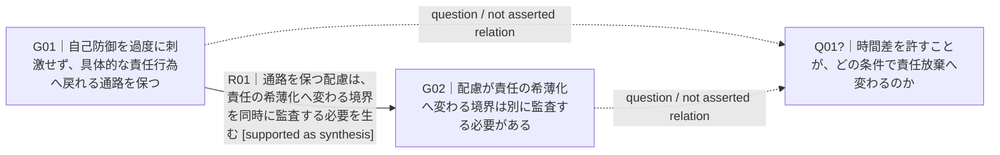
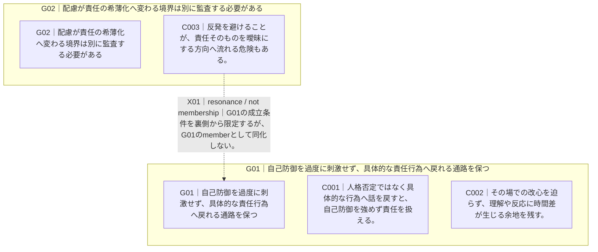

# Representation Dry Run — 2026-09-06

Status: research note

## Purpose

Check whether the proposed `affinity-map` interchange and reference Mermaid renderer can preserve the intended distinctions among group membership, explicit relation, secondary resonance, and gap-as-question on a small real-task-derived example.

## Fixture

Input:

- `examples/minimal-map.json`
- schema candidate: `references/affinity-map.schema.json`
- renderer: `scripts/render_mermaid.py`

The example is derived from the earlier accountability / non-conversion synthesis comparison, simplified for representation testing.

## Checks performed

### 1. JSON / schema

The schema was loaded with a Draft 2020-12 validator and checked as a schema.

`examples/minimal-map.json` validated successfully against the candidate schema.

Result: **pass**

### 2. Group projection generation

Command-equivalent:

```text
python render_mermaid.py minimal-map.json --view group
```

Observed source shape:



Checks:

- R01 remains a full natural-language predicate rather than becoming `causes` / `depends-on`.
- the directed connector does not itself claim causality; predicate text carries the meaning.
- Q01 links are explicitly labeled as question links, not asserted semantic relations.

Result: **pass for source generation**

Rendered visual inspection has not yet been performed in this branch.

### 3. Membership projection generation

Command-equivalent:

```text
python render_mermaid.py minimal-map.json --view membership
```

Observed source shape:



Checks:

- C003 remains a member of G02 only.
- X01 is not represented by duplicating C003 inside G01.
- resonance is visibly labeled `not membership`.

Result: **pass for source generation**

## Findings

### F1. Separate projections are preferable to one overloaded map

The group map and membership map answer different review questions. Combining both into one diagram would add visual density and make a dashed resonance easy to misread as an ordinary semantic edge.

Current decision: keep projection-specific views.

### F2. A question link needs explicit non-assertion labeling

A dashed line by itself is not enough. Different renderers and readers attach different meanings to line style.

Current decision: keep textual labels such as `question / not asserted relation` and `resonance / not membership`; do not rely on color or dash style alone.

### F3. Mermaid does not cover the spatial-map requirement

The reference renderer intentionally ignores free-position layout coordinates except for a warning comment. This is correct for the topology projection but leaves a deliberate open item: a spatial renderer must preserve coordinates without turning them into semantic edges.

## Remaining gates

1. render the generated Mermaid with an actual Mermaid renderer and visually inspect line crossing / label clipping;
2. run the same semantic record through a free-position projection such as Excalidraw or SVG;
3. test with a nested higher-order group;
4. test with 100+ cards and verify that overview/detail splitting remains usable;
5. add lineage projection after the core notation stabilizes.
