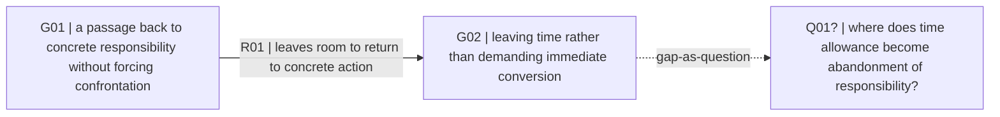
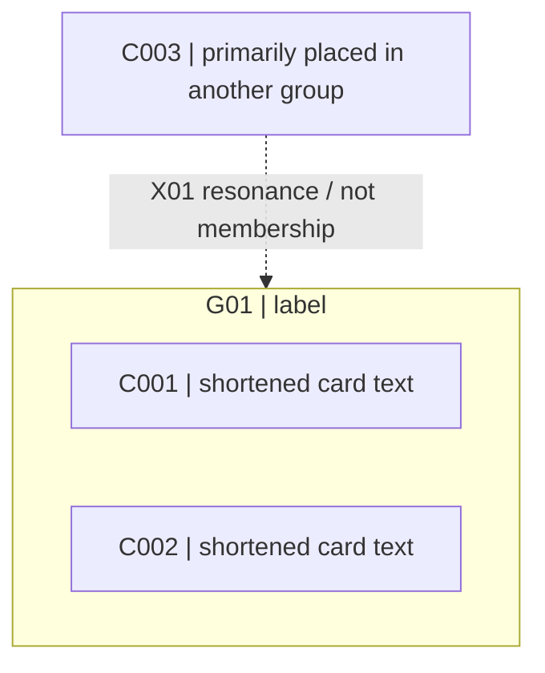

# Affinity Synthesis Representation Grammar

Status: research candidate, English translation draft

## 1. Purpose

This document defines a **representation contract** for carrying the semantic structure of Affinity Synthesis between generative AI, humans, and diagram-rendering tools with as little distortion as possible.

Do not confuse the method itself with a rendering format.

- The Method Definition states **what must be preserved**.
- The Representation Grammar states **how a preserved result may be recorded**.
- Mermaid, Excalidraw, SVG, canvas, and similar formats are projections made from that record.

Do not change source meaning, residuals, relation state, or lineage merely to make a diagram cleaner.

## 2. Representation principles

### R1. Semantic record before rendering

Do not make the diagram the only canonical artifact.

At minimum, retain cards, groups, labels, relations, resonance, residuals, and questions in text or a machine-readable record from which a diagram could be regenerated.

### R2. Stable IDs are handles, not categories

IDs such as `C001`, `G01`, and `R01` are reference handles. Their prefixes are not semantic classifications.

Suggested prefixes:

- `S`: source reference
- `C`: meaning-bearing card
- `G`: group / bundle
- `R`: explicit relation
- `X`: secondary resonance / cross-link
- `U`: residual / unresolved item
- `Q`: gap-as-question

Use different prefixes when the task calls for them.

### R3. Membership, relation, resonance, and layout are different things

Keep these distinct.

1. **membership** — a card or lower-level group currently constitutes a group.
2. **relation** — a readable predicate is asserted between two meaning units.
3. **secondary resonance** — an item also resonates with another group without adding primary placement or membership.
4. **layout** — visual placement such as near/far, above/below, left/right, or enclosure.

Do not infer that proximity proves a relation, that a line proves membership, or that resonance adds another unit of independent support.

### R4. Relation meaning stays open

Do not force relation meaning into a closed vocabulary such as `causes / depends-on / contradicts ...`.

Keep each relation as a short natural-language predicate.

Examples:

- “reduces resistance while leaving a passage back to concrete responsibility”
- “connects institutionally, but the on-site judgment criteria are not shared”
- “addresses the same event while placing responsibility in opposite directions”

A renderer or downstream tool may add auxiliary tags when useful, but a tag must not replace the relation predicate itself.

### R5. Direction and epistemic state are separate from predicate

Separate the **meaning**, **direction**, and **epistemic state** of a relation.

Minimal direction notation:

- `A -> B`: asserts direction from A to B.
- `A <-> B`: asserts mutual direction.
- `A -- B`: asserts a relation but no direction.

`->` does not itself mean causation. Whether the relation is causal, conditional, temporal, or something else belongs in the predicate.

State should remain open text by default. Common examples include `supported`, `tentative`, and `unresolved`, but they are not a closed enum.

### R6. A diagram may omit detail without deleting it from the synthesis

For readability, a diagram may omit card text, lineage, or residual detail.

Omission from a projection is not deletion from the semantic record. The diagram remains a projection.

### R7. Explicit relations must survive proposition read-back

When a strong semantic relation is asserted as `R`, audit it at least once by reading

```text
[source meaning unit] + [predicate] + [target meaning unit]
```

as a natural sentence.

The purpose is not to see whether it fits a fixed concept-mapping vocabulary. Check instead:

- whether direction and predicate fit each other;
- whether subject and object have been reversed;
- whether the predicate invents causality, intention, generalization, or responsibility direction;
- whether the relation still holds when returning to its `basis`;
- whether a relation marked `supported` should actually be `tentative` or `unresolved`.

If the read-back fails as a sentence or is not supported when returned to the material, do not invent a better-sounding predicate just to preserve the line.

- weaken the relation;
- withdraw `R`; or
- if the connection still matters, return it to `Q` as a questionable relation candidate.

This read-back is an **audit operation**, not a requirement to duplicate the same meaning in another schema field.

## 3. Compact human-readable grammar

For small outputs or review work, use a compact line notation when useful.

```text
S01 := "source reference"

C001 := "card text that can be read as a standalone appeal" @source[S01]
C002 := "another card" @source[S02]

G01["the label voices what this bundle says together rather than naming a category"] := {C001, C002}
G02["another group label"] := {C003, C004}

X01: C005 ~> G01 :: "its primary placement is elsewhere, but this difference also resonates with G01"

R01: G01 -> G02 :: "when G01 holds, the available choices in G02 narrow" @basis[C001,C004] @state["supported"]
R02: G02 -- G03 :: "both address the same event but place responsibility differently" @basis[C006,C008]

U01 := "a temperature difference that would disappear if integrated" @refs[C002,C007]
Q01? := "why does only this connection appear one-directional?" @arises_from[G01,G03]
```

This notation is not intended as strict EBNF. It is compact notation that lets humans and LLMs read back the same structure.

### 3.1 Group membership

```text
G01["label"] := {C001, C002, C003}
```

Higher-order integration may include groups as members.

```text
G10["higher-order label"] := {G01, G02, C019}
```

Membership in `G10` does not erase lower-level differences or lineage.

### 3.2 Secondary resonance

```text
X01: C019 ~> G02 :: "how / why it resonates"
```

`~>` is neither membership nor an explicit semantic relation. It is a cross-link that preserves polysemous resonance without double-counting the item.

### 3.3 Explicit relation

```text
R01: G01 -> G02 :: "relation predicate" @basis[C001,G02] @state["tentative"]
```

- `predicate` should be short natural language whose meaning can still be read from the line.
- `basis` traces what comparison or integration raised the relation. It is not equivalent to an independent-support count.
- add `state` only when useful.

After adopting a relation, audit it by reading it back as a sentence when needed.

```text
G01 “Label A” points toward G02 “Label B” in the sense that [predicate].
```

The read-back sentence does not need to be duplicated in the canonical record. It is an operation for checking whether predicate, direction, and endpoints preserve meaning.

### 3.4 Residual and gap-as-question

```text
U01 := "still-unintegrated difference" @refs[C003,C008]
Q01? := "question made visible by arrangement" @arises_from[G02,U01]
```

`Q` is a question raised by a gap. It does not assert that a missing object or relation exists.

### 3.5 Questionable / missing relation candidate

If arrangement, narration, or cross-checking suggests that two units may be connected but no predicate yet survives return-to-source checking, do not create `R`.

```text
Q07? := "is G02 connected to G05 through a time lag?" @arises_from[G02,G05]
```

Auxiliary fields may be recorded when helpful.

```text
@candidate_relation[G02,G05]
@would_clarify[C021,S08]
```

This is a **question** about a missing link, not an assertion that the missing relation exists.

## 4. Inventory tables

As material grows, compact notation alone can become difficult to audit. Markdown outputs may use inventory tables.

### 4.1 Group inventory

| Group | Label | Members | Secondary resonance | Preserved differences |
|---|---|---|---|---|
| G01 | ... | C001, C002 | C019 → G01 | ... |

### 4.2 Relation inventory

| Relation | From | Predicate | To | Direction | State | Basis | Read-back audit |
|---|---|---|---|---|---|---|---|
| R01 | G01 | ... | G02 | -> | supported | C001, C004 | survives / revise / withdraw |

Do not compress the predicate into a single edge-type keyword.

`Read-back audit` is not another field for duplicating relation meaning. It records only whether endpoint + predicate + direction survives sentence read-back and return to the material.

### 4.3 Residual / question inventory

| ID | Text | Arises from / refs | Current handling |
|---|---|---|---|
| U01 | ... | C002, C007 | keep separate |
| Q01 | ... | G01, G03 | next-round candidate |

### 4.4 Questionable relation / missing-link candidate inventory

| Question | Between / arises from | Why it looks connected | What would support / refute | Current handling |
|---|---|---|---|---|
| Q07 | G02, G05 | ... | ... | keep as question / promote after return-check / dissolve |

Items in this table are not `R`. If shown on a diagram, do not give them the same visual semantics as confirmed explicit relations.

## 5. Machine-readable interchange

When machine-readable output is needed, `affinity-map.v0.1` JSON is the current research recommendation.

JSON is an interchange format, not the authority for the method. See `affinity-map.schema.json` for the schema candidate.

Minimal example:

```json
{
  "format": "affinity-map",
  "version": "0.1",
  "cards": [
    {"id": "C001", "text": "...", "source_refs": ["S01"]}
  ],
  "groups": [
    {"id": "G01", "label": "...", "members": ["C001", "C002"]}
  ],
  "resonances": [
    {"id": "X01", "from": "C003", "to": "G01", "note": "..."}
  ],
  "relations": [
    {
      "id": "R01",
      "from": "G01",
      "to": "G02",
      "direction": "directed",
      "predicate": "...",
      "state": "supported",
      "basis": ["C001", "C004"]
    }
  ]
}
```

Relation read-back does not require duplicating the same meaning in canonical JSON. A questionable relation candidate remains a `Q` / question record until promoted to an explicit relation.

## 6. Diagram projections

Do not force everything into one giant diagram. Choose a projection for the purpose.

### 6.1 Group relationship map — default overview

Show:

- group ID + label;
- explicit relations;
- relevant residuals / gap questions.

Card text is normally omitted.

**Useful for:** reading the whole relational structure in a way close to an A-type diagram, discussion, and the starting point for narration.

### 6.2 Membership map — diagnostic

Show:

- group boundary;
- member card ID + short text;
- singleton;
- secondary resonance.

Include only the explicit relations needed for the diagnostic purpose.

**Useful for:** return checks such as “does this card really belong under this label?” and “does it also resonate with another group?”

### 6.3 Lineage map — audit

Show:

```text
source -> card -> group / label -> relation / narrative claim
```

**Useful for:** auditing double-counted derivations, returning to source, and mistaken treatment of emergent meaning.

### 6.4 Spatial map — when geometry itself matters

Use this when proximity, separation, gaps, enclosure, center/periphery, or other **spatial placement itself** should be preserved.

Do not make an automatic Mermaid layout the only canonical representation. When needed, retain optional normalized coordinates or layout hints in the machine-readable record and project them to Excalidraw, SVG, canvas, or another renderer.

Example:

```json
"layout": {
  "projection": "spatial-map",
  "positions": {
    "G01": {"x": 0.18, "y": 0.42},
    "G02": {"x": 0.55, "y": 0.37}
  }
}
```

Coordinates are not relation assertions. Do not generate `R` merely because `G01` and `G02` are close.

## 7. Mermaid projection rules

Use Mermaid as a portable **topology projection**.

### 7.1 Group map example



### 7.2 Membership map example



### 7.3 Visual semantics

- solid directed arrow: explicit directed relation
- solid undirected line: a relation is asserted, but no direction is asserted
- dashed arrow: auxiliary projection such as resonance or gap link; always label its meaning
- for states such as tentative / unresolved, do not rely on line style or color alone; retain readable text in an edge label or legend
- do not promote a questionable relation / missing-link candidate to the same solid line as `R`; show it as `Q?` or leave it to a detail view
- do not make color the only carrier of meaning

### 7.4 Rendering limits

Mermaid automatic layout may alter original spatial arrangement only when the projection is meant to show **topology** rather than meaningful geometry.

If placement itself is analytic material, create a separate spatial map.

When a diagram becomes too dense for relations and labels to remain readable, do not force it to a fixed node count. Split it into overview, detail, lineage, or other useful projections.

## 8. Diagram validation

When a rendering tool is available, check at least the following.

1. Syntax renders successfully.
2. Labels are not clipped.
3. Relation direction matches the semantic record.
4. Explicit relation meaning survives endpoint + predicate + direction read-back.
5. Resonance does not look like membership or additional support.
6. A questionable relation candidate does not look like a confirmed relation.
7. Omitted detail is not treated as if it were deleted from the synthesis.
8. Line crossings or automatic layout do not visually imply unsupported causality or hierarchy.

When no rendering tool is available, the source may be returned with `render not validated` stated explicitly.

## 9. Projection integrity check

After generating a diagram, compare it with the semantic record.

- **record -> diagram:** did an important relation, residual, or resonance disappear?
- **diagram -> record:** did the diagram add a line, containment, or ordering that does not exist in the record?
- **layout -> semantics:** was proximity or vertical placement reinterpreted as unsupported meaning?
- **relation -> proposition read-back:** when an explicit relation is read back as a sentence, are its direction, predicate, and endpoints still supported by the material?
- **candidate -> relation:** was a questionable / missing-link candidate promoted to `R` without a return check?
- **diagram -> narrative:** did visual emphasis alone cause the narrative to amplify importance or causality?

A diagram that fails this cross-check is not a valid projection of Affinity Synthesis, even if it looks polished.
