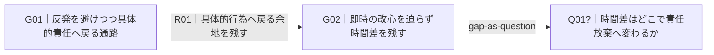
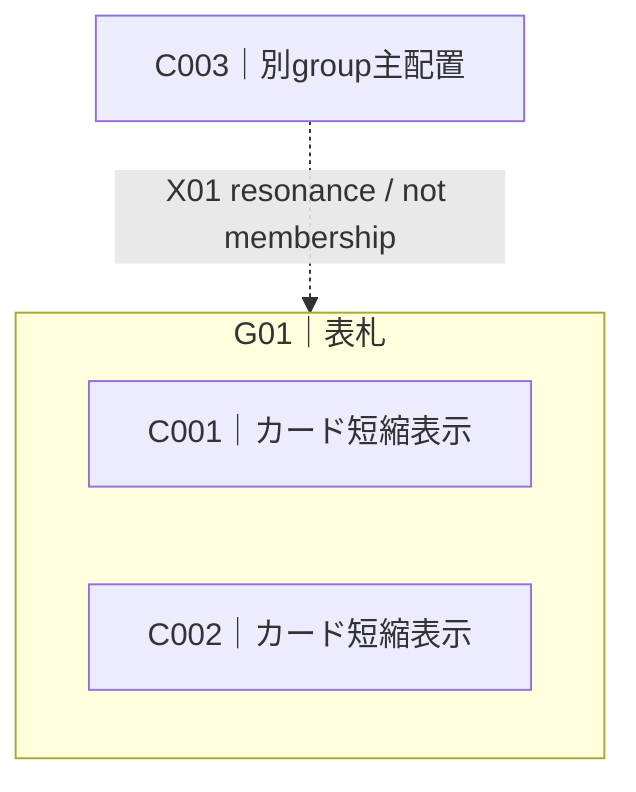

# Affinity Synthesis Representation Grammar

Status: research candidate

## 1. Purpose

この文書は、親和統合の意味構造を、生成AI・人間・図描画ツールの間でなるべく壊さず受け渡すための**表現契約**を定める。

方法そのものと描画形式を混同しない。

- Method Definition は「何を守るか」を定める。
- Representation Grammar は「守った結果をどう記述するか」を定める。
- Mermaid / Excalidraw / SVG / canvas 等は、その記述から作る projection である。

図をきれいにするために、材料の意味、残差、関係の確度、来歴を変更しない。

## 2. Representation principles

### R1. Semantic record before rendering

図を唯一の正本にしない。

最低限、カード、群、表札、関係、resonance、残差、問いを、図を再生成できる形でテキストまたはmachine-readable recordへ残す。

### R2. Stable IDs are handles, not categories

`C001`, `G01`, `R01` 等のIDは参照用handleであり、そのprefix自体を意味分類として扱わない。

推奨prefix:

- `S`: source reference
- `C`: meaning-bearing card
- `G`: group / bundle
- `R`: explicit relation
- `X`: secondary resonance / cross-link
- `U`: residual / unresolved item
- `Q`: gap-as-question

用途に合わなければ別prefixでもよい。

### R3. Membership, relation, resonance, and layout are different things

次を同一視しない。

1. **membership** — あるcard / lower groupが現在のgroupを構成する。
2. **relation** — 二つの意味単位の間について、読み返せるpredicateを主張する。
3. **secondary resonance** — 主配置やmembershipを増やさず、別のgroupにも意味上響く。
4. **layout** — 図で近く置く、離して置く、上・下・左右に置く等の描画上の配置。

近く描かれたから関係がある、線があるからmembershipである、resonanceがあるから独立supportが一票増える、とは解釈しない。

### R4. Relation meaning stays open

関係の意味を `causes / depends-on / contradicts ...` のような閉じた語彙へ固定しない。

relationは自然言語の短いpredicateとして保持する。

例:

- 「反発を弱め、具体的な責任行為へ戻る通路を作る」
- 「制度上は接続するが、現場の判断基準は共有していない」
- 「同じ出来事を扱うが、責任の置き場所が逆向きである」

必要なら renderer や downstream tool のために補助tagを付けてもよいが、tagがrelation本文を置き換えてはならない。

### R5. Direction and epistemic state are separate from predicate

relationの**意味**、**向き**、**確度・状態**を分ける。

向きの最小記法:

- `A -> B`: AからBへの方向を主張する。
- `A <-> B`: 相互方向を主張する。
- `A -- B`: 関係は主張するが方向を主張しない。

`->` は因果を意味しない。因果か条件か時間順序か等はpredicate本文で読む。

確度・状態は自由記述を基本とする。よく使う例として `supported`, `tentative`, `unresolved` があるが、閉じたenumとはしない。

### R6. A diagram may omit detail without deleting it from the synthesis

図の可読性のためにcard本文、lineage、residual detailを省略してもよい。

ただし省略はsemantic recordからの削除ではない。図はprojectionである。

## 3. Compact human-readable grammar

小規模な成果物やレビュー時には、次のline notationを使える。

```text
S01 := "source reference"

C001 := "単独で何を訴えているか読めるカード本文" @source[S01]
C002 := "別のカード本文" @source[S02]

G01["表札はカテゴリ名ではなく、この束が共同して言うこと"] := {C001, C002}
G02["別の束の表札"] := {C003, C004}

X01: C005 ~> G01 :: "主配置は別にあるが、この差異がG01にも響く"

R01: G01 -> G02 :: "G01が成立するとG02の選択余地が狭まる" @basis[C001,C004] @state["supported"]
R02: G02 -- G03 :: "両者は同じ出来事を異なる責任配置で読む" @basis[C006,C008]

U01 := "統合すると消えてしまう温度差" @refs[C002,C007]
Q01? := "なぜこの接続だけ片方向に見えるのか" @arises_from[G01,G03]
```

この記法はEBNF厳密準拠を目的としない。人間とLLMが同じ構造を読み返すためのcompact notationである。

### 3.1 Group membership

```text
G01["label"] := {C001, C002, C003}
```

上位統合ではgroupをmemberに含められる。

```text
G10["higher-order label"] := {G01, G02, C019}
```

`G10`へ入れたからといって、下位の差やlineageを消さない。

### 3.2 Secondary resonance

```text
X01: C019 ~> G02 :: "how / why it resonates"
```

`~>` はmembershipでもexplicit semantic relationでもない。二重計上を避けつつ多義的な響きを残すためのcross-linkである。

### 3.3 Explicit relation

```text
R01: G01 -> G02 :: "relation predicate" @basis[C001,G02] @state["tentative"]
```

- `predicate` は、線だけを見ても意味を読み返せる短い自然言語文にする。
- `basis` は、このrelationが何を比較・統合して立ったかを辿るhandleである。独立support数とは同義ではない。
- `state` は必要な場合だけ付ける。

### 3.4 Residual and gap-as-question

```text
U01 := "still-unintegrated difference" @refs[C003,C008]
Q01? := "question made visible by arrangement" @arises_from[G02,U01]
```

`Q` は空白から生じた問いであり、欠けている対象が実在するというassertionではない。

## 4. Inventory tables

材料数が増えた場合、compact notationだけでは監査しにくい。Markdown成果物では次のinventory表を推奨する。

### 4.1 Group inventory

| Group | Label | Members | Secondary resonance | Preserved differences |
|---|---|---|---|---|
| G01 | ... | C001, C002 | C019 → G01 | ... |

### 4.2 Relation inventory

| Relation | From | Predicate | To | Direction | State | Basis |
|---|---|---|---|---|---|---|
| R01 | G01 | ... | G02 | -> | supported | C001, C004 |

relation inventoryでは、predicateを単一のedge-type keywordだけに縮めない。

### 4.3 Residual / question inventory

| ID | Text | Arises from / refs | Current handling |
|---|---|---|---|
| U01 | ... | C002, C007 | keep separate |
| Q01 | ... | G01, G03 | next-round candidate |

## 5. Machine-readable interchange

machine-readable出力が必要な場合は `affinity-map.v0.1` JSONを推奨する。

JSONは方法の正本ではなくinterchange formatである。Schema候補は `affinity-map.schema.json` を参照する。

最小例:

```json
{
  "format": "affinity-map",
  "version": "0.1",
  "cards": [
    {"id": "C001", "text": "...", "source_refs": ["S01"]}
  ],
  "groups": [
    {"id": "G01", "label": "...", "members": ["C001", "C002"]}
  ],
  "resonances": [
    {"id": "X01", "from": "C003", "to": "G01", "note": "..."}
  ],
  "relations": [
    {
      "id": "R01",
      "from": "G01",
      "to": "G02",
      "direction": "directed",
      "predicate": "...",
      "state": "supported",
      "basis": ["C001", "C004"]
    }
  ]
}
```

## 6. Diagram projections

一つの巨大図へ全部を詰め込まない。目的に応じてprojectionを選ぶ。

### 6.1 Group relationship map — default overview

表示するもの:

- group ID + 表札
- explicit relations
- 必要なresidual / gap question

通常はcard本文を省略する。

**向く用途:** A型図解に近い全体関係の読み、議論、叙述の起点。

### 6.2 Membership map — diagnostic

表示するもの:

- group boundary
- member card ID + 短い本文
- singleton
- secondary resonance

explicit relationは必要なものだけ載せる。

**向く用途:** 「この表札に本当にこのcardが載るか」「別groupにも響いていないか」の戻し検査。

### 6.3 Lineage map — audit

表示するもの:

```text
source -> card -> group / label -> relation / narrative claim
```

**向く用途:** 派生物の二重計上、sourceへの遡及、emergent meaningの取り違えの監査。

### 6.4 Spatial map — when geometry itself matters

近接、離隔、空白、囲み、中心／周縁など、**配置自体**を保持したい場合に使う。

Mermaid等のautomatic layoutだけを正本にしない。必要ならmachine-readable recordへ任意のnormalized coordinatesやlayout hintを保存し、Excalidraw / SVG / canvas等へ投影する。

例:

```json
"layout": {
  "projection": "spatial-map",
  "positions": {
    "G01": {"x": 0.18, "y": 0.42},
    "G02": {"x": 0.55, "y": 0.37}
  }
}
```

座標はそれ自体ではrelation assertionではない。`G01`と`G02`が近いからといって、`R`を自動生成しない。

## 7. Mermaid projection rules

Mermaidは可搬性の高い**topology projection**として使う。

### 7.1 Group map example



### 7.2 Membership map example



### 7.3 Visual semantics

- solid directed arrow: explicit directed relation
- solid undirected line: relation exists, direction not asserted
- dashed arrow: resonance、gap link等の補助projection。必ずlabelで意味を明示する。
- tentative / unresolved等のstateは、線種や色だけへ預けずedge labelまたはlegendでも読めるようにする。
- 色だけを唯一の意味carrierにしない。

### 7.4 Rendering limits

Mermaidのautomatic layoutが、元の空間配置を変えることを許容するのは、**topologyだけを見せるprojection**の場合である。

配置自体が分析対象なら、spatial mapを別成果物として作る。

図が密になり、edge crossingやlabel衝突で意味が読めなくなった場合は、固定node数へ機械的に合わせるのではなく、overview / detail / lineage等へ分割する。

## 8. Diagram validation

rendering toolを利用できる場合、図は少なくとも次を確認する。

1. syntaxが通る。
2. labelが切れていない。
3. relationの向きがsemantic recordと一致する。
4. resonanceがmembershipやsupportに見えない。
5. omitted detailが削除された事実として扱われていない。
6. line crossingやautomatic layoutが、誤った因果・階層を視覚的に暗示していない。

rendering toolがない場合は、sourceを出力し `render not validated` と明示できる。

## 9. Projection integrity check

図を生成した後、semantic recordと照合する。

- **record -> diagram:** 重要relation / residual / resonanceが落ちていないか。
- **diagram -> record:** 図だけに新しい線・包含・順序が増えていないか。
- **layout -> semantics:** 近接や上下配置を、元にない意味へ読み替えていないか。
- **diagram -> narrative:** 図の視覚的強調だけを根拠に、文章で重要度や因果を増幅していないか。

この照合を通らない図は、見栄えが良くても親和統合の正しいprojectionではない。
