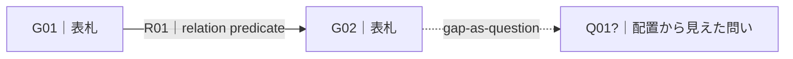

# Affinity Synthesis — Standard Output Template

このテンプレートは標準成果物の一例であり、方法定義そのものではない。用途に応じて省略・別表現へ変換してよいが、元材料への戻りと残差の可視性を失わない。

書式・diagram projectionの詳細は `REPRESENTATION.md` を参照する。

## 1. Synthesis Subject

- **Question / purpose:**
- **Scope:**
- **Source set:**
- **What must not be flattened:**

## 1A. Reader-facing Overview — fill last

この節は**最初に書かない**。cards / groups / relations / narrative / return-to-source checkを行った後に、下位成果物から作るreader-facing projectionである。

### What the material currently says

[3–5文程度。主要な表札と関係を、必要なら `G / R / U / Q` IDを添えて述べる。結論を滑らかにするためにresidualや対立を消さない。]

### Overview table

| Group | Label | Contribution to the current reading | Member count | Anchor refs | Current caution / residual |
|---|---|---|---:|---|---|
| G01 | | | | C001, C004 | |
| G02 | | | | C008 | |

**この表の読み方:**

- **Member count** は現在のworking geometryでの記述値であり、truth、importance、independent supportの強さを意味しない。
- **Anchor refs** は読者が詳細へ降りるためのnavigation用であり、代表例だけを証拠として残すためのものではない。完全なmembershipとlineageは後続節へ残す。
- 強い少数派、singleton、conflict、薄い違和感を、overviewに入れにくいという理由で落とさない。
- summaryが詳細map / narrativeと矛盾した場合、summaryを正本にせずsemantic recordへ戻す。

### Residuals that change the reading

- **Singleton / outlier:**
- **Conflict / tension:**
- **Unresolved question:**
- **Borderline grouping or relation:**

読者がoverviewだけ読んでも、「何がまだ分からないか」「何を無理に束ねなかったか」が見える状態を目指す。

## 2. Source and Lineage Notes

必要な範囲だけ記載する。

| Ref | Source provenance | Discovery route | Input status / role | Derivation / independence note |
|---|---|---|---|---|
| | | | | |

`source provenance` と `discovery route` が同じ場合でも、概念上は区別する。派生物を独立資料として数えないための情報が必要なら `Derivation / independence note` に残す。

`Input status / role` は、観察、報告、仮説、未解決、外部探索由来のquestion / correspondence等を、元の認識状態を消さずに受け取るための欄である。呼出側が `framework_generated`、`target_supported`、`cross_field_emergent`、`unresolved` 等の語彙を持つ場合は、その語彙を保持できるが、このテンプレート自身が閉じたtaxonomyを要求するわけではない。

provenanceやstatusは監査情報であり、最初のgrouping geometryにはしない。外部探索由来の仮説・correspondenceを、target-side sourceの一票や独立supportへ自動変換しない。後から対象材料で独立に支持された場合は、その新しいsupportと元の由来を両方残す。

## 3. Meaning-bearing Cards

| Card ID | Card | Source ref | Input status / role | Epistemic seam / preservation note |
|---|---|---|---|---|
| | | | | |

カードは短さを目的にしない。単独で何を訴えているか読め、かつ証拠状態の継ぎ目を黙って潰していないことを優先する。

question / hypothesis / correspondenceをcard-like artifactとして扱う必要がある場合も、そのroleを観察事実へ書き換えない。対象側の意味単位と近く見えても、status/provenanceだけを理由に同じ束へ入れたり、別束へ隔離したりしない。

## 4. Groups and Labels

### Group G1 — [表札]

**Members:** C1, C2, ...

**Secondary resonance:** C7 → G1 ...

**What these cards jointly say:**

**Differences that must remain visible:**

**Transformation audit:**

- **Inherited meaning:** 入力材料から直接保持した意味。
- **Emergent meaning:** 複数材料の接触によって新しく立った意味。元材料へ遡及させない。
- **Residual meaning:** 融合へ入れなかった差・矛盾・温度・未解決。
- **Meaning at risk of being lost:**
- **Correction needed after return-to-source:**

同じ形式を必要な群について繰り返す。

`Inherited / Emergent / Residual` は入力カードを先に分類する欄ではない。表札・統合文を立てた**後**に、変換で何が起きたかを監査するために使う。

### Compact notation when useful

```text
G01["表札"] := {C001, C002, C003}
X01: C007 ~> G01 :: "別group主配置のままG01にも響く理由"
```

`~>` はmembershipでも独立supportでもない。

## 5. Singletons / Tensions / Unresolved

| Ref | What remains | Why not merged | What would clarify it |
|---|---|---|---|
| | | | |

「何か気になるが理由はまだ分からない」状態も、無理に仮説化せずここへ残せる。

## 6. Relational Structure

関係を、単なる線ではなく後から読み返せるpredicateとして残す。

### Relation inventory

| Relation | From | Predicate | To | Direction | State | Basis | Read-back audit |
|---|---|---|---|---|---|---|---|
| R01 | G01 | ... | G02 | -> | supported / tentative / ... | C001, C004 | survives / revise / withdraw |

`Predicate` は自由な自然言語を基本とし、固定edge taxonomyへ縮めない。

`Read-back audit` はrelationの意味を別fieldへ複製保存するための欄ではない。`From + Predicate + To` を自然な一文として読み返し、directionとbasisへ戻してもその関係が維持できるかを記録する。

向きの最小記法:

- `A -> B`: AからBへの方向を主張する。因果を自動では意味しない。
- `A <-> B`: 相互方向を主張する。
- `A -- B`: 関係は主張するが方向を主張しない。

compact notation:

```text
R01: G01 -> G02 :: "relation predicate" @basis[C001,C004] @state["tentative"]
```

read-back例:

```text
G01「表札A」は、[relation predicate] という意味で、G02「表札B」へ向く。
```

この文が不自然、過剰、または材料へ戻すと支持できない場合、predicateを作文して線を維持しない。`state`を弱める、`R`を撤回する、または次のquestionable relation candidateへ戻す。

### Questionable relation / missing-link candidates

| Question | Between / arises from | Why it looks connected | What would support / refute | Current handling |
|---|---|---|---|---|
| Q07 | G02, G05 | ... | ... | keep as question / promote after return-check / dissolve |

ここにあるものは `R` ではない。「線がありそう」という違和感・空白を問いとして外在化する欄である。

- proximityやcross-linkがあるだけでrelationへ昇格させない。
- missing linkが実在すると断定しない。
- supporting materialが得られた場合も、predicate / direction / basisを作って元材料へ戻した後にのみ `R` へ昇格する。
- 何も支持しなければcandidateを解消・撤回してよい。

### Group-level text view

```text
[G1: ...]
   ├─ R01: 「...」 ──> [G2: ...]
   ├─ R02: 「...」 ─── [G3: ...]
   └─ unresolved link → [Q1?]
```

関係名は材料が支持する範囲で付ける。空白を埋めるためだけに因果・時間順序を発明しない。

### Gaps visible from the arrangement

- Gap Q1:
  - Why it appears:
  - What is actually known:
  - What is not yet known:

空白は次の問い候補であり、欠けている何かが実在すると断定するものではない。

## 7. Diagram Projection

図が有効なら、semantic recordからprojectionを作る。図だけを正本にしない。

**Projection used:** group relationship / membership / lineage / spatial / other

**Diagram source:** Mermaid / Excalidraw / SVG / other

**Render validation:** validated / not validated

**Detail intentionally omitted from diagram:**

### Mermaid example — group relationship map



Mermaidはtopology projectionとして使う。近接・離隔・空白など**配置自体**を保持する必要がある場合は、必要に応じてnormalized coordinatesをmachine-readable recordへ残し、自由配置できるdiagram formatへ投影する。

### Projection integrity check

- semantic recordにある重要relation / residual / resonanceが図で不注意に落ちていないか。
- 図だけに新しい線・包含・順序が増えていないか。
- proximityを、元にないrelationへ読み替えていないか。
- secondary resonanceがmembershipや独立supportに見えていないか。
- questionable relation candidateが、確定relationと同じ線に見えていないか。

## 8. Narrative Synthesis

関係構造を読んで文章化する。

文章化の際に新しい意味が生じること自体は禁止しない。ただし、新しい意味は「元材料に最初からあった事実」とは区別し、次節の照合で扱う。

## 9. Cross-check

### Source → Cards / Groups

- 落ちた重要な訴え:
- 過剰に弱めた表現:
- 過剰に細分化した箇所:

### Groups / Map → Source

- 元にない因果:
- 元にない人物内面・意図:
- 元にない一般化:
- 評価方向の変化:
- 確度の変化:
- 行為者・責任方向の脱落:
- explicit relationをread-backしたとき、source / target / predicate / directionが噛み合わない箇所:
- questionable relation candidateをreturn-checkなしにrelationへ昇格した箇所:
- external exploration inputをtarget-side supportへ無言で昇格させた箇所:
- emergent meaningをsource由来へ遡及させた箇所:
- その他の違和感:

### Map ↔ Narrative

- MapにあるがNarrativeで落ちた関係:
- NarrativeにあるがMapにない関係:
- 新しく生じたが、元材料で再確認できた関係:
- 新しく生じたが、まだ未検証の関係:

## 10. Final Residuals

- **Singletons kept:**
- **Conflicts kept:**
- **Unresolved questions:**
- **Questionable / missing relation candidates still open:**
- **External exploration inputs still not target-supported:**
- **Intentionally omitted differences:**
- **Possible next-round inputs:**

`Possible next-round inputs` は引継ぎ情報であり、このSkill自身が次ラウンドを開始する指示ではない。
