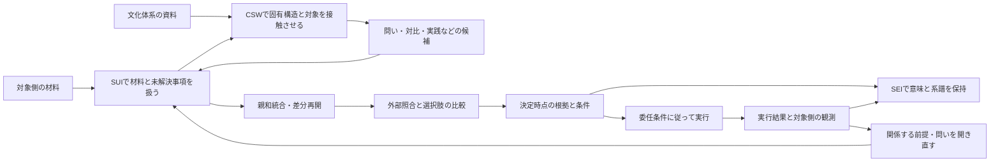

# CSW・SEI・SUIを組み合わせる認知基盤の設計方式

- 作成日・日本語推敲日: 2026-10-06
- 状態: 呼び出し側の構成を検討する研究草案。実装済みの方式や、効果を確認したMethod Definitionではない。
- 対象: 人間、AI、または両者を含む主体が、開いた問いを扱い、不確実性を残しながら決定・実行・再評価するための認知基盤。
- 関連: [全体構成の草案](cognitive-foundation-architecture.md)、[評価依頼](chatgpt-evaluation-request.md)、[記録の先行例調査](research-records/01-record-prior-art.md)。本書は追加案であり、これらの文書の結論を採用済みに変更しない。

## 1. 設計の中心

複合利用では、問いを増やすこと、材料を統合すること、決定を記録することを一つの連続した作業にする。そのうえで、どの段階でも元の材料と、その時点の判断へ戻れるようにする。

CSWは文化体系との接触から、問い、関係、対比、遷移、価値基準や実践の候補を生む。SUIは材料とその組み替えを扱う作業面を提供する。SEIは観測・解釈・推奨・決定・権限・実行の区別を保ち、判断が変わった経緯を辿れるようにする。この接続によって目指すのは、探索の広がりを決定へつなぎ、実行後の観測から探索を開き直すことである。効果は検証課題として残る。

複合利用の単位を「案件に属する問いと決定の履歴」とする。製品のセッションや一人の担当者の記憶だけを、その履歴の同一性にはしない。担当・モデル・保存先が変わっても、問い、材料、判断、未解決事項の関係を追えることを目指す。

人間の承認を毎回必要とするかは、案件の委任条件で決める。AIが決定主体として働く構成も対象に含めるが、現在の製品契約がその構成を実現済みだとは扱わない。「主体として働く」は、目的を受け取り、探索し、選択を固定し、委ねられた範囲で実行につなぎ、結果に応じて更新する行動上の意味で用いる。法的な人格や責任能力の主張は含めない。

## 2. 設計を深める作業そのもの

設計者は最初に、製品名を外して、対象案件で必要な行動と失敗を記述する。そこへ製品と方法を割り当て、既存契約でできること、接続の実装が必要なこと、まだ方式を決められないことを分ける。

設計上の主張は、次の順で具体化する。

| 段階 | 記録する内容 | 次へ進める条件 |
|---|---|---|
| 作業仮説 | 何を改善するつもりか、比較対象は何か | 観測できる行動と反例を言える |
| 必要な能力 | 材料の取得、統合、比較、決定、再開など | 入出力と責務を言える |
| 接続契約 | 参照、意味、失効、引継ぎ、非対応の扱い | 元記録との対応と、変換で失われる情報を示せる |
| 実現候補 | 既存製品、接続用アダプター、外部サービス、手作業 | 必要な能力の有無を確認できる |
| 評価用の試行 | 正常な案件と、構成を反証する案件 | 記録と実際の挙動を照合できる |
| 採用判断 | 残す範囲、費用、未解決条件 | 判断主体と根拠が明示される |

一件の試行で接続の不備が見つかれば、接続案を直す。一件で有用だった認知操作を、CSWや兄弟方法の恒久規則へ移さない。方式の定義、Agent Skillとしての実現、交換形式、評価用の案件、適用記録は別の成果物として保持する。

## 3. 製品と方法の責務

| 担い手 | 複合利用での役割案 | 他の担い手へ渡すもの |
|---|---|---|
| CSW | 文化体系の固有構造を開き、対象との差・抵抗・対応から候補を作る | 体系の版・位置・経路、対象参照、候補、残差、変換の記録 |
| affinity-synthesis | 一回の材料主導統合。カード化、群、表札、関係、図解と叙述と元材料の往復 | 統合結果と、元材料へ戻る参照、変換履歴、残差 |
| iterative-inquiry-synthesis | 複数回の差分再開。変更に関係する成果物を開き直す | 再開理由、変更対象、安定した意味ID、追加した履歴 |
| SUI | カード・島・保留を扱い、候補と原文を辿る作業面を提供する | 対象の成果物版、来歴、レビュー、採用状態 |
| SEI | 判断に関係する意味の区別と参照・系譜を保持する | 決定時点の根拠、未解決参照、責任参照、後続判断との関係 |
| 呼び出し側 | 目的、専門能力、権限、探索予算、比較基準、実行・検証系を接続する | 案件条件、利用可能な能力、委任記録、実行結果、照合結果 |

親和統合と差分再開の内部は研究中の兄弟方法が所有する。SUIでカードを扱えることから、それらの方法が実行されたとは推定しない。SEIで意味を記録できることから、内容が検証されたとも推定しない。

必須の製品依存は設けない。互換性のある方法や別の保存・表示手段を利用できる。一方、案件が必要とする能力が欠けたときは、その部分を非対応と記録する。似た文章を生成して、未実行の方法を実行済みにしない。

## 4. 探索、決定、学習を別の進行として接続する

探索では候補を変更できる。決定では、その時点の根拠と条件を固定する。学習では、後の観測から後続の判断を作る。案件全体を一つの状態名だけで表すと、この三つが混ざる。

図の矢印は構成上の受け渡し案であり、実装済みのAPI接続を表さない。SEIへの記録は決定後だけでなく、各段階で行える。SUIの盤面も、すべての記録を保存する唯一の正本にはしない。

探索中の候補、決定済みの内容、実行の進捗、保留、権限の有効性を別々に持つ。決定後も未解決事項は残りうる。決定を撤回しても、既に起きた実行結果は消えない。

## 5. 問いを決定へつなぐ

問いごとに「何が分かると、何を変えられるか」を記録する。決定に直結する問いなら、答えによって変わる選択肢、前提、評価軸、実行条件を示す。探索のための問いなら、理解のどこを広げたいかを記録し、直ちに行動への寄与を要求しない。

| 問いの役割 | 例 | 確認する変化 |
|---|---|---|
| 前提を確かめる | 導入を妨げているのは技能不足か、引継ぎの負担か | 問題設定や選択肢が変わる |
| 選択肢を作る | 一斉導入以外に、試せる単位はあるか | 新しい行為候補ができる |
| 価値の衝突を見つける | 速度の向上によって誰の負担が増えるか | 比較基準と関係者が変わる |
| 遷移を考える | 現状から目標へ移る途中に何が必要か | 順序、条件、撤回可能な段階が変わる |
| 理解を広げる | 既存の分類から外れた材料をどう読めるか | 新しい区別や未解決事項が残る |

CSW由来の問いについては、体系に固有の位置、関係、遷移が問いをどう変えたかを辿れるようにする。体系名だけを付けた一般的な発想指示を、固有構造の利用と数えない。

文化体系から得た価値基準や実践候補も探索に含められる。たとえば「何を守るべきか」という候補が出た場合、その価値を検討することと、案件の目的として採用することを分ける。体系が提供した価値を、対象や決定主体の既存の価値に黙って置き換えない。

## 6. 材料の統合から選択肢の比較へ

親和統合は、材料を理解し、問題の構造を見直すために使う。意思決定へ進むときは、そこから行為候補を別に作る。群の大きさ、出現頻度、図解の整合だけで行為を選ばない。

選択肢ごとに、期待する結果、その結果へ至る見通し、必要条件、反対の材料、費用、影響する相手、可逆性、未確認事項を記録する。現状維持、延期、追加調査も案件に応じて選択肢に含める。専門的な品質基準は領域スキルや担当者から受け取る。

図解と叙述が一致していても、それは表現間の整合である。対象との一致は別に確認する。孤立したカードや図解に入らなかった材料も、重大な反例になりうるため辿れるようにする。

判断材料の強さは、出所の権威や文化体系との適合度から自動的には導かない。対象側での照合、測定条件、適用範囲を記録し、案件の比較基準に従って使う。

## 7. 接続で保持する最小の区別

受け渡しで保持すべき区別を共通の契約にする。各製品のデータモデルをすべて統一する必要はない。

| 区別 | 保持する内容 |
|---|---|
| 同一性と版 | 意味上のID、参照した厳密な版、内容照合の方式 |
| 由来と検証 | 生じた経路と、後に何で確認したか |
| 原文と派生物 | 引用、要約、翻訳、統合、再読後の説明の関係 |
| 根拠と発見経路 | 問いが生まれた理由と、決定時に考慮した材料 |
| 内容と採用 | 仮説の内容と、誰がどの範囲で採用したか |
| 採用と権限 | 成果物を採用する手続きと、行為を委ねる権限 |
| 決定と実行 | 何を選んだか、実際に何をしたか、その結果 |
| 発生時点と記録時点 | 状況が変わった時点と、その変化を知り記録した時点 |

CSWの来歴ラベルは、交換時にも元の記述と定義の版を保持できる。共通形式の単一ラベルへ置換せず、必要なら由来と検証の別記録を添える。`cross_field_emergent`を対象側の支持と読み替えず、`unresolved`を否定事実に変えない。

たとえばCSWから問いQが生まれ、外部観測Oによって関連する主張Hが支持された場合、Qの発見経路とHへの支持関係を別に残す。元のCSW記録を「最初から観測だった」と書き換えない。QとHが同じ文を持つ場合でも、記録としての役割を区別する。

参照は、論理ID、厳密な版、内容の照合に使う表現方式、必要な引用範囲を持つ。ハッシュによる内容一致と、主張の真偽の確認は別である。原文を保存できない場合は、アクセス条件と取得不能の理由を残す。

W3C PROV-DMのEntity・Activity・Agentと派生関係は来歴の交換に、Web Annotationの対象と選択子は原文内の範囲指定に参考になる。ただし、いずれも決定の正しさや行為の権限を保証するものとしては使わない。これらの項目は今回、仕様本文で確認した。[PROV-DM、2013年](https://www.w3.org/TR/prov-dm/)、[Web Annotation Data Model、2017年](https://www.w3.org/TR/annotation-model/)。

## 8. 記録六種を、保存形式と作業上の表示へ分ける

既存草案の六種は、利用者が何を扱うかを示す分類として残せる。保存形式まで六種類に固定するかは、まだ決めない。材料・主張・決定・イベントの共通部分と、各記録固有の意味を組み合わせる案を比較する。

| 作業上の記録 | 最低限辿れるもの |
|---|---|
| カード | 原文または派生内容、厳密な版、取得先、引用範囲、変換履歴 |
| 保留台帳 | 問い、未解決理由、次の確認、解除条件、期限または期限を置かない理由、遅延費用 |
| 事前登録 | 予測・前提・撤回条件の区別、対象、結果を見る前に固定した内容、照合方法・時点 |
| 決定記録 | 内容、選択肢、採否理由、当時の根拠、反対材料、未解決事項、委任参照 |
| 再開記録 | 変更の契機、確認した前提、開き直す対象、継続する部分、担当・モデルの変更 |
| 停止記録 | 止めた範囲、契機、未完了の行為、引継ぎ先、再開条件 |

この六種に加えて、権限の付与・失効、実行要求・実行結果、対象側の観測、照合結果、誤りの判定を辿れる必要がある。専用の新型を作るか、既存のSEI契約とプロファイルで表すかは未決とする。

保留や停止は、出来事の履歴と現在の表示を分ける。現在の台帳は履歴から組み立てられるが、文面の意味を更新する場合は、各製品の契約に従って成果物を改訂する。すべての意味変更を単なるイベント再生で扱おうとはしない。

## 9. 受け渡しは、送信しただけで成立したと扱わない

受け渡し単位には、案件・対象範囲、送り手、解釈契約のIDと版、対象記録への厳密な参照、拡張の識別、期待する次の処理を含める。具体的な項目名は交換草案で決める。

受け手は、記録を保持できたか、意味を理解できたか、参照を取得・照合できたか、必要な処理を実行できるかを別に返す。原文を保持できても、未知の文化体系の記録を解釈できないことはある。意味を理解できても、外部資料を取得できないこともある。

接続用アダプターは、変換した範囲、失われた情報、対応できない意味を記録する。未知の拡張は保持するか拒否し、既知の型へ黙って変換しない。各製品に固有の意味を完全に往復できない場合は、元記録を正本として残し、共通記録を限定された翻訳として扱う。

同じ受け渡しの再送は識別できるようにする。重複して届いた記録から、新しい決定や外部行為を重ねて作らない。並行した変更が衝突した場合は、どちらも残して調停対象を明示する。到着順だけで採用や権限を決めない。

## 10. 決定時点を固定し、委任条件へ接続する

決定の前に、目的、選択肢、根拠の版、未解決事項、予測、撤回条件、権限の参照を一緒に確かめる。どこまでの項目を要求するかは、案件の影響、可逆性、期限、費用に応じて呼び出し側が定める。

予測を結果の採点に使う場合、採点対象と判定基準を結果を見る前に固定する。探索的に得た説明は、事前の予測へ遡って追加しない。決定の直前に材料が更新されたときは、当時の版を採るか、変更を確認して決定を更新するかを明示する。

決定内容を固定すること、実行を許可すること、外部行為を開始することは別の処理にする。権限は決定時だけでなく、必要な外部行為の開始時にも確認する。探索のための問い合わせや資料共有にも行為があるため、その範囲に関係する委任条件を確認する。

承認が必要な案件では、承認・修正・却下・失効を記録する。承認者が根拠や条件を変えたときは、変更後の内容を新しい版として扱う。承認が不要な案件でも、適用した委任条件への参照は残す。すべてを人間の承認へ戻す方式にはしない。

現行SUIのAuthorityは、厳密な成果物版に対する採用状態を扱う。`authorizedBy.kind="policy"`は将来の予約であり、現在のAccepted・Consensusへの自動昇格には使わない。AIがDecisionペイロードを生成したことから、人間のDecision Authorityは得られない。したがって、承認なしのAI決定をSUIの現行Accepted状態で擬似的に表す方式は採らない。

複合利用では、SUI上の候補を参照しつつ、外部委任の下で作ったAIの決定を、その由来を持つ別記録として扱う案がある。これは接続の設計候補であり、SUIの意味契約を変更したことにも、SEIが委任・実行系を実装済みであることにもならない。SUI上で採用状態を変える場合は、SUI自身の手続きが別に必要である。

## 11. 実行後の観測から、必要な箇所だけを開き直す

実行要求、実行系の応答、実際の対象側の結果を別に記録する。応答が成功でも、業務上の目的が達成されたとは限らない。応答が失われた場合も、未実行だと決めつけない。再試行の前に、実行済みか確認できる経路を用意する。

再開の契機は、新しい観測だけではない。前提の期限切れ、権限の変更、目的の改訂、文化体系の読み直し、専門能力の不足、参照切れ、実行失敗も含む。

| 変更の種類 | 先に開き直す対象 |
|---|---|
| 材料の更新・反証 | その材料を使った主張、群、選択肢、決定 |
| 文化体系の読みの訂正 | その読みから生まれた候補と接触の記録 |
| 目的・価値の変更 | 評価軸、採否理由、未実行の決定 |
| 委任条件の失効 | 関係する実行と、権限を前提にした決定 |
| 実行の部分失敗 | 残った行為、取消し・補償の可能性、次の観測 |
| 担当・モデルの交代 | 再開時の理解、利用能力、方法の実現版 |

関係の記録を使って変更の影響範囲を探し、関係が記録されていない場合は、どこまで影響するか未確認とする。差分再開は、無条件に狭い範囲だけを直す命令ではない。目的や枠組みが変われば、広い再検討が必要になる。

過去の決定D1の根拠は保持し、新しい観測を根拠にD2を作る。D2をD1の改訂・置換・撤回へ結びつける関係は、内容差や保存時刻だけから自動生成しない。再開用の要約は作り直せるが、履歴の意味を権威的に書き換えない。

## 12. 保存量と現在の注意を分ける

再開時には、現在の目的、最後の決定、未解決事項、変更点、次の確認、参照不能な根拠を短い表示にまとめる。各項目から当時の記録へ戻れるようにする。要約から落ちた事項が、解決済みになったとは扱わない。

意味を保持する記録と、再開を助ける表示を分ける考え方は、SEIの評価用Cognitive Resumption Modelに既にある。本案では、その表示をSUI上の作業と結びつける候補として使う。評価用モデルを現行契約へ昇格させるものではない。

原文と詳細な履歴を残す方針も、プライバシー、利用条件、保持期限に従う。削除したときは、保存しなかった理由や取得不能の状態を必要な範囲で残す。無制限の永久保存を認知基盤の成立条件にはしない。

## 13. 探索の深さと停止を案件ごとに設計する

次の操作として、別の文化体系を開く、材料を追加する、統合をやり直す、選択肢を比較する、限定的に実行する、保留する、という候補を並べる。何を選ぶかは、追加費用と、判断が変わる見込みを案件の基準で比較する。

判断が変わる見込みを数値化できない場合は、未確認として残し、理由を伴う見通しで比較する。架空の情報価値スコアを計算して精度を装わない。

カードの新規性が枯れたことは、探索を終える理由の候補になるが、十分に調べた証明にはならない。逆に、新しい問いが出続けても、期限や遅延損失によって決める必要がある。判断が変わらない問いだけでラウンドを延ばさない。

文化体系を閉じること、統合を終えること、案件を保留すること、外部実行を止めることを区別する。委任範囲や利用可能な能力を越えた場合の処理は、呼び出し側が明示する。本案から、CSW固有の課題種別による非発動規則や先回りした意図の抑制は作らない。

## 14. 一案件を通した机上例

以下は方式を説明するための架空の例であり、観測事例、Living Lab記録、製品の実行証拠ではない。領域手順の正しさや文化体系の具体的適用を検証する例でもない。

ある組織が、新しい業務ツールを全体へ導入するか検討する。呼び出し側は目的、評価基準、決定の範囲、問い合わせや試行の権限を置く。SUIには現場記録、費用、困り事、未確認事項を、原文参照とともに載せる。

CSWで文化体系を開いた結果、「一斉移行を前提にする必要はあるか」「移行中に負担が集中する場所はどこか」という問いが出たと仮定する。実際の適用では、どの体系のどの構造から出たかを記録する。この例だけでは文化体系固有の寄与を示せない。

親和統合で材料を整理し、一斉導入、限定試行、現状維持を行為候補として分ける。対象側への確認から、技能よりも引継ぎ負担が問題だと分かった場合、その確認を新しい観測として残す。CSW由来の問い自体を対象事実へ変更しない。

決定主体は、比較基準、対象側の観測、未確認事項、予測、撤回条件を使って限定試行を選ぶ。SEIに記録する決定は、その時点の材料版を参照する。許可された実行系が試行し、応答と実際の負担変化を別に記録する。

後日、負担が別部門へ移ったと分かれば、成功した試行という説明だけを残さず、関係する問い、負担の評価軸、選択肢を開き直す。最初の決定は当時の根拠を持つ履歴として残し、変更後の決定へ結びつける。

## 15. 構成を確定する前の最小検証

まず公開可能な材料か私的な評価環境で、次のケースを通す。これらは設計の不備を探すための試行であり、有効性を主張する比較実験とは分ける。

| ケース | 観察すること |
|---|---|
| 生成候補が後に支持される | 発見経路と後の支持が残り、過去の根拠が変わらないか |
| 未解決のまま決める | 未解決参照と解除条件が決定・再開に残るか |
| 原文や権限が更新される | 内容一致、適用範囲、実行権限を別々に確認するか |
| 担当・モデルが交代する | 決定と提案を区別し、残差を落とさず再開できるか |
| 未知の契約・拡張が届く | 保持、意味の理解、実行可能性を分けて返すか |
| 再送・同時編集・部分実行が起きる | 重複行為や、他者の判断の暗黙の上書きを避けられるか |
| 人間承認あり・なしを切り替える | 構成の必要な変更と、現行契約の非対応を明示できるか |

次に、CSWの利用有無、統合方法、再開表示の利用有無を、一度にすべて変えず比較する。同じ材料集合・費用上限の比較と、問いに応じて材料収集まで変える通し比較を分ける。前者は操作の差、後者は探索全体の差を調べる。

問いの数や見慣れなさだけで採点しない。重要な前提の発見、選択肢や収集計画の変更、利用者の採用、再開の正確さ、照合に要した費用、後日の撤回を別々に記録する。結果の良さ、当時の判断過程の品質、その方法が結果を生んだという因果的主張も分ける。

意味の妥当性はスキーマ検査だけでは判断できない。AI評価者の解釈、利用者の判断、直接観測、測定を別経路で残す。判定者がモデル、材料、手続きを共有する場合は、その相関の可能性も記録する。

## 16. 元草案への差分提案と未決事項

| 元草案の箇所 | 本案で具体化した変更 |
|---|---|
| H1・十項目 | 観点として残し、製品を外した行動・失敗・接続から不足を点検する |
| H2 | 親和統合を材料理解の有力な候補とし、選択肢比較を別工程にする |
| H3・CSWの責務 | 問いに加え、対比・遷移・価値・実践の候補と、体系固有の発見経路を扱う |
| H4・来歴 | 原文再読、変換履歴、版の照合、対象側での検証を別にする |
| H5・足場 | 外部委任、領域能力、実行結果、照合結果を接続する |
| H6・承認 | 共通の意味記録を保ちつつ、承認の状態遷移と現行SUIの境界を明示する |
| 記録六種 | 作業上の表示と保存形式を分け、実行・観測・照合・権限を補う |
| 決定サイクル | 目的と委任の確認を冒頭へ置き、事前登録を結果の取得前に行い、差分で再開する |
| 優先順位 | 小さな反証試行を構成確定前に置く |

設計者が次に決めるのは、最初の対象案件、必要な能力、受け渡す記録の範囲、権限・実行・検証の提供元である。その案件に必要な最小プロファイルと接続用アダプターを草案化し、机上の試行から実行を伴う試行へ進める。

共通交換の項目名、各製品のアダプター、承認なしの決定を受け取るプロファイル、依存関係からの影響範囲の算出、並行判断の調停、保持・削除の手続きは未決である。CSWの効果、親和統合の比較優位、複合利用の費用対効果も未検証である。

## 17. 確認した資料と証拠の範囲

2026-10-06にローカル作業ツリーの以下の範囲を読み、必要な契約境界を確認した。HEADは参照位置の識別であり、リポジトリ全体の検証済み状態を示さない。SEIの作業ツリーには本作業と無関係の変更がある。本書作成では兄弟リポジトリへ書き込んでいない。

| 資料 | 確認した範囲 |
|---|---|
| CSW、HEAD `7972fb9be56485d6d4a420be0011b5c4e50f14a7` | 全体構成草案、兄弟製品対応表、`src/ja-JP/core/principles-and-constraints.md`、内部変更点・記録の調査資料の関連節 |
| SEI、HEAD `0a52e4fe94a75d61b8aa7adc92a53807a7deb9b5` | `contracts/decision-memory/SEI_DECISION_MEMORY_v1alpha1.md` §1〜§10、`contracts/interchange/SEI_SEMANTIC_INTERCHANGE_v1alpha1.md` §1〜§8、`contracts/semantic-reference/SEI_SEMANTIC_REFERENCE_v1alpha1.md` §1〜§4 |
| SEI、評価用モデル | `evaluation/personal-inquiry-decision/COGNITIVE_RESUMPTION_MODEL.md` §1〜§3の冒頭。耐久的な記録と再開表示の区別 |
| SUI、HEAD `2aea09bd4762127e25fd52c8bad5acc15e61e33f` | `02_Architecture/sensemaking_artifact_contract_v1alpha1.md` §6.2〜§8、`sensemaking_payload_authority_exchange_v1alpha1.md`のAI生成とDecision Authorityに関する記述 |
| W3C、2013・2017年 | PROV-DMとWeb Annotation Data Modelの、来歴と対象・選択子に関する記述 |

文書の記述を確認したことは、契約の実装試験、実環境での接続、方式の有効性を確認したことにはならない。本案の機械的な確認範囲は、文書内の相対リンク、形式上の不備、日本語の静的検査である。内容確定後に、識別子・意味・証拠の区別を保った独立の日本語推敲を行った。
